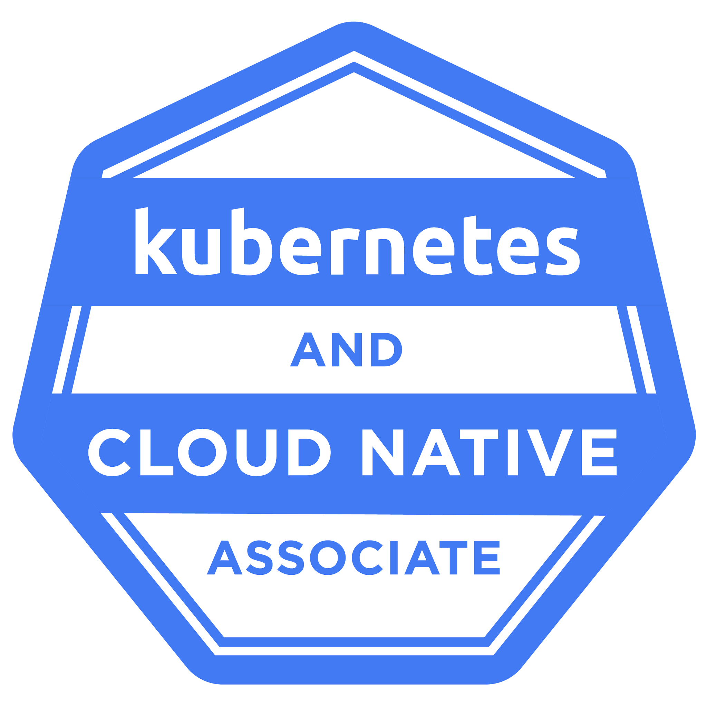

# Kubernetes and Cloud Native Associate (KCNA) in 2024

The Kubernetes and Cloud Native Associate (KCNA) exam is a pre-professional certification designed for candidates interested in advancing to the professional level through a demonstrated understanding of kubernetes foundational knowledge and skills. This certification is ideal for students learning about or candidates interested in working with cloud native technologies.

  

# Certification

- Duration of Exam: **90 minutes**.
- Number of questions: **60 test tasks with multiple choice exam**.
- Passing score: **75%** or above.
- Certification validity: **2 years**.
- Cost: **$250 USD**.
- Exam Eligibility: **12 Month**, with a free retake within this year.
- [The official website with certification](https://trainingportal.linuxfoundation.org/courses/kubernetes-and-cloud-native-associate-exam-kcna)
- [CNCF Exam Curriculum repository](https://github.com/cncf/curriculum/)
- [Tips & Important Instructions: CKAD](https://docs.linuxfoundation.org/tc-docs/certification/important-instructions-kcna)
- [Candidate Handbook](https://www.cncf.io/certification/candidate-handbook)
- [Verify Certification](https://training.linuxfoundation.org/certification/verify/)

# Structure of certification

## Kubernetes Fundamentals - 46%

### Kubernetes Resources

1. **Pods**:
- Definition: The smallest, most basic deployable object in Kubernetes. A pod represents a single instance of a running process in a cluster.
- Content: Explanation of how to create and manage pods, multi-container pod patterns, and their lifecycle.

2. **Nodes**:
- Definition: A worker machine in Kubernetes, where containers are scheduled and run. A node contains the necessary services to run the pods and is controlled by the master node.
- Content: Details on how nodes are part of the Kubernetes architecture, their role, and how they interact with pods.

3. **Namespaces**:
- Definition: A way to divide cluster resources between multiple users via namespaces.
- Content: Guide on namespace usage for resource isolation and management in multi-user environments.

4. **ConfigMaps and Secrets**:
- Definition: ConfigMaps store configuration data that can be referenced in pods, while Secrets store sensitive information (e.g., passwords, API keys) in a secure way.
- Content: Instructions on how to use ConfigMaps and Secrets in pods and managing them in clusters.

5. **Persistent Volumes (PVs) and Persistent Volume Claims (PVCs)**:
- Definition: PVs are storage resources available to pods, while PVCs request storage for a pod.
- Content: Information on how Kubernetes manages storage and the lifecycle of data using PVs and PVCs.

6. **Resource Quotas**:
- Definition: Constraints applied to limit the resource consumption per namespace.
- Content: How to set resource quotas to control memory, CPU, and storage usage for better resource management.

7. **Requests and Limits**:
- Definition: Requests define the minimum amount of a resource a container needs, while limits specify the maximum amount of resources a container can use.
- Content: Overview of configuring requests and limits for CPU and memory in containers, and best practices for resource management.

8. **DaemonSets, Deployments, and StatefulSets**:
- Definition: Kubernetes controllers that manage the scheduling and lifecycle of pods.
- DaemonSet: Ensures all nodes run a copy of a pod.
- Deployment: Manages stateless services.
- StatefulSet: Manages stateful applications.
- Content: How to create, scale, and update applications using these controllers.

9. **Service Resources**:
- Definition: Abstracts the communication between pods and directs traffic inside the cluster.
- Content: Explanation of different service types (ClusterIP, NodePort, LoadBalancer) and how to expose and load balance services.

10. **Ingress**:
- Definition: Manages external access to services in a cluster, typically HTTP/HTTPS.
- Content: How to create and manage Ingress resources, configure routes, and set up secure connections using TLS.

11. **Horizontal Pod Autoscaler (HPA)**:
- Definition: Automatically scales the number of pods in a deployment based on observed CPU utilization or other application metrics.
- Content: Guide on setting up and configuring HPA for workloads, with considerations for scaling policies.

12. **Vertical Pod Autoscaler (VPA)**:
- Definition: Automatically adjusts the CPU and memory resource requests of running pods.
- Content: How to configure and apply VPA for more efficient resource usage.

13. **Resource Metrics API**:
- Definition: Provides resource usage metrics for nodes and pods in the cluster.
- Content: Discussion on how the Kubernetes metrics server works, accessing real-time metrics, and using them for autoscaling.

**Useful official documentation**

- None

**Useful non-official documentation**

- None

### Kubernetes Architecture

1. **Master Node (Control Plane)**:
- Definition: The master node controls and manages the Kubernetes cluster and is responsible for the orchestration of the various components.
- Components:
  - API Server: The entry point for all REST commands used to control the cluster. It serves as the primary management point and processes the user requests, validating and executing them.
  - Etcd: A distributed key-value store that stores the cluster state and configuration information.
  - Scheduler: Assigns pods to nodes based on resource availability, affinity rules, and constraints. It ensures efficient resource allocation.
  - Controller Manager: Runs different controllers (replication controller, endpoint controller, namespace controller, etc.) to monitor and reconcile the desired state with the actual state of the cluster.

2. **Worker Nodes**:
- Definition: Nodes that host application containers and are managed by the control plane. Each node runs various components to facilitate the deployment and operation of pods.
- Components:
  - Kubelet: An agent that ensures containers in a pod are running, communicating with the master node to receive instructions and maintain the cluster's desired state.
  - Container Runtime: Software responsible for running containers, with Docker being one of the most commonly used runtimes.
  - Kube-Proxy: A network proxy that manages network connectivity and load balancing across services. It routes requests from the service to the appropriate pod on the node.

3. **Pods**:
- Definition: The smallest deployable unit in Kubernetes. Pods encapsulate one or more containers, networking resources, and storage.
- Content: Explanation of how pods are scheduled on worker nodes and their role in application deployment.

4. **Cluster**:
- Definition: A group of nodes (both master and worker) managed by Kubernetes. The cluster is responsible for running containerized applications.
- Content: Explanation of cluster setup, multi-node clusters, and high availability.

5. **Control Plane vs Data Plane**:
- Control Plane: Includes the master components (API server, etcd, scheduler, controller manager). Responsible for controlling the overall state of the cluster.
- Data Plane: Worker nodes and their resources (pods, containers). Responsible for executing the workloads and processing the actual application data.

6. **Cluster Networking**:
- Definition: Manages communication between pods, services, and external networks. Kubernetes uses flat network structures to ensure that pods can communicate across nodes.
- Components:
  - CNI (Container Network Interface): Manages networking plugins to ensure pod-to-pod, pod-to-service, and external-to-service communication.
  - Service Networking: Abstracts the underlying pod IPs and allows external clients to connect to the Kubernetes services using stable IPs and DNS names.
  - Content: Includes discussion on pod IP addresses, service types, network policies, and ingress controllers.

7. **Services**:
- Definition: Kubernetes services expose applications running in pods either internally or externally to the cluster. They maintain network traffic routing and load balancing between pods.
- Content: Overview of different service types: ClusterIP, NodePort, LoadBalancer, and Ingress.

8. **Persistent Storage and Volumes**:
- Definition: Kubernetes uses persistent volumes and claims to provide long-term storage that can persist even when pods are destroyed and recreated.
- Components: Persistent Volumes (PV) and Persistent Volume Claims (PVC) ensure the decoupling of storage from the pod lifecycle.
- Content: Explanation of how Kubernetes abstracts storage across various cloud and on-premise providers using StorageClasses.

9. **High Availability (HA) in Kubernetes**:
- Definition: In a highly available Kubernetes cluster, the master components are replicated across multiple nodes to ensure reliability and uptime.
- Content: Strategies for ensuring HA, including multi-master setups, use of etcd clustering, and redundancy across nodes.

10. **Kubernetes Control Loops**:
- Definition: A control loop watches the current state of the cluster, compares it to the desired state, and makes adjustments to achieve the desired state.
- Content: Overview of reconciliation loops like the replication controller, which ensures that the number of pods matches the specified replica count, and node controllers that monitor node health.

11. **Add-Ons and Extensions**:
- Definition: Kubernetes can be extended through various add-ons and third-party tools, including monitoring, logging, service discovery, and more.
- Content: Popular Kubernetes add-ons include:
- Helm: A package manager for Kubernetes to simplify application deployment.
- Prometheus & Grafana: For monitoring and visualization.
- CoreDNS: Default DNS server for Kubernetes clusters.

### Kubernetes API

1. **Kubernetes API Overview**:
- Definition: The Kubernetes API is the primary interface for interacting with the Kubernetes cluster, including querying the state of resources (pods, nodes, etc.), modifying configurations, and managing the cluster.
- Content: Explanation of how the API is REST-based, allowing users to perform GET, POST, PATCH, and DELETE operations on cluster resources.

2. **API Server**:
- Definition: The Kubernetes API Server is the component that exposes the Kubernetes API. It serves as the front-end for the control plane, processing RESTful API calls and communicating with other components like the etcd database.
- Content: Overview of the API Server’s role in the control plane and how it handles authentication, authorization, admission control, and other API-specific security measures.

3. **API Objects**:
- Definition: Everything in Kubernetes is represented as an API object, such as Pod, Node, Service, Deployment, and Namespace.
- Content: Details on how Kubernetes objects are represented in JSON or YAML format and how users interact with these objects via the API.
- Examples of API Objects:
- Pod Object: Contains information about the container(s), such as image, ports, environment variables, and resource requirements.
- Service Object: Abstracts a set of pods to provide network access, with load balancing options.
- Deployment Object: Describes the desired state for application deployment.

4. **Kubernetes API Groups and Versions**:
- Definition: Kubernetes groups its API into API Groups to organize related resources and their versions. Examples include:
- Core Group: Contains fundamental resources like pods, services, and nodes.
- apps/v1 Group: Contains resources for managing applications, such as deployments and daemonsets.
- Content: Explanation of how Kubernetes uses API versioning (v1, v2alpha1, etc.) to introduce breaking changes and experimental features while maintaining backward compatibility.
- Stable API: APIs in the v1 version are considered stable and backward-compatible.
- Alpha/Beta APIs: Alpha and Beta APIs may change over time and are used for features in development.

5. **CRUD Operations with the API**:
- Definition: CRUD (Create, Read, Update, Delete) operations are the foundation of interacting with the Kubernetes API to manage resources.
- Content:
  - Create: Using POST requests to create new resources.
  - Read: Using GET requests to retrieve resource information.
  - Update/Patch: Using PUT or PATCH requests to update existing resources.
  - Delete: Using DELETE requests to remove resources.
  - These operations can be performed programmatically via the API or through tools like kubectl, which internally uses the API to manage cluster objects.

6. **API Endpoints**:
- Definition: Each Kubernetes resource has its corresponding API endpoint. For example:
- Pods: /api/v1/namespaces/{namespace}/pods
- Nodes: /api/v1/nodes
- Deployments: /apis/apps/v1/namespaces/{namespace}/deployments
- Content: Explanation of how endpoints are constructed and how clients can interact with specific resources by making HTTP requests to these endpoints.

7. **API Access Control**:
- Authentication: Determines the identity of users or service accounts interacting with the API (e.g., tokens, certificates).
- Authorization: Determines what actions the authenticated user is allowed to perform (using Role-Based Access Control, RBAC).
- Admission Controllers: Validate and modify requests before they reach the etcd database or are passed to other components.
- Content: Overview of how Kubernetes ensures security by layering authentication, authorization, and admission control on API interactions.

8. **API Extensions and Custom Resource Definitions (CRDs)**:
- Definition: Custom Resource Definitions (CRDs) allow users to extend the Kubernetes API by defining new types of resources.
- Content: Details on how CRDs enable cluster operators to introduce custom objects and controllers to manage applications without modifying the core Kubernetes code.
- Example: A custom resource might define an application-specific object like DatabaseCluster, managed by a custom controller.

9. **API Server Metrics and Monitoring**:
- Definition: The API server provides metrics that can be monitored to understand API request latency, error rates, and overall system health.
- Content: Information on how to access these metrics using monitoring tools such as Prometheus or kubectl top.

10. **Using kubectl with the API**:
- Definition: kubectl is the command-line tool that communicates directly with the Kubernetes API Server to manage resources.
- Content: Overview of how kubectl internally makes REST API calls to the Kubernetes API server and how you can perform actions like creating resources (kubectl apply), reading their state (kubectl get), and deleting them (kubectl delete).

11. **API Rate Limiting**:
- Definition: To ensure the API server doesn’t get overwhelmed, Kubernetes enforces rate limits on API requests, which help to prevent DoS attacks and resource exhaustion.
- Content: Information on how rate limiting is applied, and strategies to optimize API performance under load.

12. **Swagger API Documentation**:
Definition: Kubernetes API is self-documented and provides Swagger UI for accessing all available API endpoints, objects, and parameters.
Content: How to use the Swagger API docs for generating client code and understanding API objects' structure.

### Containers

1. **Definition of Containers**:
- Definition: Containers are lightweight, portable, and self-contained environments that package applications along with their dependencies, such as libraries, binaries, and configuration files.
- Content: Explanation of how containers solve issues of dependency management, environment consistency, and isolation, making them ideal for microservices architectures.

2. **Container Runtime**:
- Definition: The container runtime is the software responsible for running containers. Kubernetes supports multiple container runtimes like Docker, containerd, and CRI-O.
- Content: Overview of how container runtimes integrate with Kubernetes through the Container Runtime Interface (CRI) and the role of kubelet in interacting with the container runtime to manage pod execution.

3. **Docker and Kubernetes**:
- Definition: Docker was one of the first widely used container runtimes and is often synonymous with containers, though Kubernetes now uses other runtimes as well.
- Content: Discussion of Docker’s role in containerization, container image formats, and how Kubernetes used Docker until the move to containerd and CRI-O following the deprecation of DockerShim.

4. **Container Lifecycle**:
- Definition: Describes the stages of a container’s life from its creation to its termination.
- Phases:
  - Waiting: The container is waiting to be started.
  - Running: The container is actively running.
  - Terminated: The container has finished execution and exited.
- Content: Explanation of container lifecycle management, including readiness and liveness probes that monitor container health, and lifecycle hooks that execute scripts before or after certain stages.

5. **Container Images**:
- Definition: A container image is a lightweight, standalone, executable package that includes everything needed to run a piece of software (code, runtime, libraries, environment variables).
- Content: Explanation of how container images are built, typically using a Dockerfile, and stored in container registries such as Docker Hub, Google Container Registry (GCR), and others.
- Best Practices: Guidelines on minimizing image size, layering images, and securing images by using trusted base images.

6. **Container Registries**:
- Definition: A container registry is a repository that stores and distributes container images.
- Content: How Kubernetes pulls container images from public or private registries to deploy on nodes. Details on configuring Kubernetes to authenticate with private registries and manage image tags and versions.

7. **Container Networking**:
- Definition: Containers need networking to communicate with other containers, pods, and external services. Kubernetes provides networking abstractions to make this seamless.
- Content: Overview of how containers are assigned IP addresses, and how Kubernetes handles intra-cluster communication through services and network plugins (CNI).
- Key Concepts: Container-to-container networking (within pods), pod-to-pod networking, service discovery, and the role of kube-proxy in managing traffic routing.

8. **Container Storage**:
- Definition: Containers are ephemeral, meaning their file system doesn’t persist once a container is stopped. Persistent storage is required for stateful applications.
- Content: Overview of storage solutions for containers in Kubernetes:
- Volumes: Temporary storage that exists as long as the pod exists.
- Persistent Volumes: Permanent storage managed by Kubernetes, which can outlast pod lifecycles.
- StorageClasses: Different types of storage provisioning, depending on the needs of the application.

9. **Container Security**:
- Definition: Containers run isolated from each other, but security policies need to be enforced to ensure that applications and data are protected.
- Content:
  - Security Contexts: Settings to define security policies for pods and containers, such as running containers as a non-root user.
  - Pod Security Policies (PSP): Deprecated but previously used to define the security controls for pod operations.
  - Seccomp Profiles: Restricts the system calls that a container can make.
  - Container Image Security: Importance of using signed images and scanning images for vulnerabilities.

10. **Container Orchestration with Kubernetes**:
- Definition: Container orchestration is the process of automating the management, scaling, and networking of containers.
- Content: How Kubernetes schedules, scales, and manages the lifecycle of containers across clusters of nodes. Includes features like:
- Scaling: Automatically scaling containers up or down based on demand.
- Health Checks: Using liveness and readiness probes to ensure containers are functioning as expected.
- Self-Healing: Kubernetes automatically restarts or replaces failed containers.

11. **Multi-Container Pods**:
- Definition: While most pods have a single container, multi-container pods are useful for tightly coupled services that need to share storage and networking.
- Content: Explanation of the sidecar pattern and other multi-container pod designs, where one container is responsible for logging or networking while the other runs the primary application.

12. **Containers vs Virtual Machines**:
- Definition: Containers and virtual machines (VMs) are both methods of isolating applications, but containers are more lightweight and efficient.
- Content: Comparison between containers and VMs:
- Containers: Share the host OS kernel, making them faster to start and more resource-efficient.
- VMs: Require a full OS per virtual instance, which makes them heavier but provides stronger isolation.

13. **Container Best Practices**:
- Definition: Best practices to ensure efficient and secure container usage in production environments.
- Content:
  - Image Optimization: Use minimal base images to reduce attack surface.
  - Resource Allocation: Set appropriate resource requests and limits to avoid overloading nodes.
  - Container Cleanup: Remove unused images and containers to free up space.

### Scheduling

1. **Kubernetes Scheduler Overview**:
- Definition: The Kubernetes Scheduler is a control plane component responsible for assigning pods to nodes in a cluster. It considers resource availability, constraints, and policies to ensure optimal deployment of workloads.
- Content: Introduction to the core responsibility of the scheduler — finding the most appropriate node for a pod based on resource requirements (CPU, memory, etc.), constraints (affinities, taints, tolerations), and policies (priorities, limits).

2. **Scheduling Cycle**:
- Definition: Kubernetes follows a well-defined scheduling cycle to assign a pod to a node. This cycle includes filtering nodes, scoring nodes, and making scheduling decisions.
- Phases:
  - Filtering: The scheduler filters out nodes that don’t meet the resource requirements of the pod.
  - Scoring: The remaining nodes are scored based on specific criteria, and the node with the highest score is selected.
  - Binding: Once a node is chosen, the pod is bound to that node.
- Content: Detailed explanation of the filtering and scoring phases, how pods are bound to nodes, and how Kubernetes continuously monitors the cluster for unscheduled pods.

3. **Scheduling Algorithms**:
- Definition: Kubernetes uses various algorithms to decide where to schedule pods, considering multiple factors such as resource usage, network topology, and data locality.
- Content:
  - Least-Requested: The scheduler prefers nodes with the least CPU and memory usage.
  - Most-Requested: The scheduler prefers nodes with the highest resource usage, often to pack pods more tightly.
  - Balanced Resource Usage: Prioritizes nodes with more balanced resource usage across CPU and memory.
  - Contention-Aware Scheduling: Takes into account existing resource contention between workloads.

4. **Node Affinity and Anti-Affinity**:
- Definition: Affinity and anti-affinity rules guide the scheduler on placing pods on nodes based on certain conditions or constraints.
- Content:
  - Node Affinity: Ensures pods are scheduled on specific nodes that meet the conditions (e.g., based on labels like zone or environment).
  - Pod Anti-Affinity: Prevents pods from being scheduled on the same node as other pods with specific labels, improving fault tolerance by spreading workloads across nodes.
- Example: You may use node affinity to ensure that a pod is scheduled in a specific geographical zone, or anti-affinity to avoid scheduling two critical services on the same node.

5. **Taints and Tolerations**:
- Definition: Taints and tolerations allow users to control which pods are (or aren’t) allowed to be scheduled on specific nodes.
- Content:
  - Taints: A taint prevents certain pods from being scheduled on a node unless they have a matching toleration.
  - Tolerations: A toleration allows a pod to be scheduled on a node that has been tainted.
- Example: Taints can be used to reserve certain nodes for special workloads like database applications or to isolate workloads based on priority.

6. **Resource Requests and Limits**:
- Definition: Resource requests specify the minimum CPU and memory a pod needs, while limits define the maximum it can use.
- Content:
  - Pods are scheduled based on resource requests. The scheduler ensures that the node has enough resources to meet these requests.
  - If no node can satisfy a pod’s resource request, the pod will remain unscheduled until the necessary resources become available.

7. **Preemption and Pod Priority**:
- Definition: Preemption allows high-priority pods to evict lower-priority pods if no suitable node is available for scheduling.
- Content: Explanation of the priority classes that define pod importance, and how Kubernetes uses preemption to make room for critical workloads.
- Example: When a high-priority pod (e.g., critical system service) needs to be scheduled, it may preempt a lower-priority pod by evicting it from the node.

8. **Topology-Aware Scheduling**:
- Definition: Topology-aware scheduling ensures that workloads are placed with consideration of network latency, bandwidth, or other infrastructure factors.
- Content:
- Topology Spread Constraints: A mechanism to ensure that workloads are spread evenly across different failure domains (e.g., zones, racks).
- Example: Distribute workloads across availability zones to improve resilience and minimize downtime.

9. **Custom Schedulers**:
- Definition: Kubernetes allows the use of custom schedulers alongside the default scheduler. Custom schedulers can have specialized algorithms for different types of workloads.
- Content: How to create and deploy a custom scheduler in Kubernetes, including examples where custom scheduling is beneficial, such as for batch processing or real-time applications with specific requirements.

10. **Scheduling DaemonSets**:
- Definition: DaemonSets ensure that a copy of a pod runs on all (or a specific subset of) nodes in a cluster.
- Content: Explanation of how DaemonSets are scheduled across nodes and used for cluster-wide services like logging and monitoring agents.

11. **Scheduler Performance Tuning**:
- Definition: Optimizing the performance of the Kubernetes scheduler to handle high loads and large clusters.
- Content:
  - Strategies like adjusting resource thresholds, using multiple scheduler profiles, and tuning the scheduler for specific workloads.
  - API Server Performance: How heavy scheduling workloads may affect the performance of the API server and the need for performance optimization.

12. **Inter-Pod Affinity and Anti-Affinity**:
- Definition: Allows you to specify rules for placing pods in relation to other pods. For example, inter-pod affinity rules might keep related pods together for low-latency communication.
- Content: How to use inter-pod affinity to colocate pods that should be scheduled together or anti-affinity to distribute replicas across different nodes.

13. **Batch Scheduling and Gang Scheduling**:
- Definition: Techniques for scheduling jobs that need to be started together, such as in high-performance computing (HPC) or machine learning workflows.
- Content: Discussion of how Kubernetes supports batch workloads and gang scheduling, ensuring that a group of pods is scheduled together or not at all.

14. **Handling Pod Eviction**:
- Definition: Pod eviction occurs when pods are removed from a node due to resource contention, node unavailability, or a higher-priority pod preempting a lower-priority one.
- Content: Explanation of how pod eviction is handled and strategies to reduce evictions, such as setting appropriate resource requests, using node selectors, and configuring taints/tolerations.

## Container Orchestration - 22%

### Container Orchestration Fundamentals

1. **What is Container Orchestration?**
- Definition: Container orchestration is the process of managing the lifecycle, deployment, scaling, networking, and maintenance of containers in a cluster environment.
- Content: Explanation of how container orchestration allows operators to automate the deployment of containerized applications, ensuring they are properly distributed across a cluster, resilient to failure, and scalable according to demand.
- Example: Orchestrators like Kubernetes automate tasks such as starting, stopping, and scaling containers across a cluster of machines.

2. **Why Use Container Orchestration?**
- Definition: Container orchestration is necessary for managing large-scale, distributed containerized applications, ensuring they remain available and perform efficiently.
- Benefits:
  - Automated Scaling: Automatically increases or decreases the number of containers based on load.
  - High Availability: Ensures the application remains accessible even when individual containers or nodes fail.
  - Efficient Resource Utilization: Distributes workloads evenly across nodes to maximize resource usage.
- Content: Real-world benefits of orchestration like ensuring uptime and reliability, handling updates without downtime, and the ability to easily deploy services across various environments (development, staging, production).

3. **Core Components of Container Orchestration**:
- Definition: Fundamental building blocks and tools that make container orchestration work.
- Content:
  - Cluster: A group of physical or virtual machines that run containers.
  - Scheduler: Determines where containers should be deployed based on resource availability and constraints.
  - Controller: Ensures that the desired number of container instances are always running.
  - Load Balancer: Distributes traffic among containers to ensure no single container is overloaded.
  - Service Discovery: Automatically identifies and connects containers to other services.

4. **Popular Container Orchestration Tools**:
- Kubernetes: The most popular container orchestration platform, widely used for automating deployment, scaling, and managing containerized applications.
- Docker Swarm: Docker’s native orchestration tool, simpler than Kubernetes but less feature-rich.
- Apache Mesos: A distributed systems kernel that can manage both containers and other workloads.
- Amazon ECS/EKS: Managed container orchestration services on AWS.
- Content: Comparison of these tools and their use cases.

5. **Key Concepts in Container Orchestration**:
- Pods (in Kubernetes): The smallest deployable unit, a group of one or more containers with shared storage and network resources.
- ReplicaSets: Ensures that a specified number of pod replicas are running at all times.
- Deployments: A higher-level abstraction that manages ReplicaSets and allows easy updates and rollbacks.
- Services: Expose pods to the network and ensure a stable endpoint for accessing them, even as pods are rescheduled.
- Namespaces: Provide isolation within a Kubernetes cluster, often used for organizing resources by project or team.
- Content: Detailed explanation of how each concept works and contributes to orchestration.

6. **Automation in Orchestration**:
- Definition: One of the most significant benefits of container orchestration is automation, particularly for tasks such as health checks, updates, rollbacks, and scaling.
- Content:
  - Health Checks: Automatically restart containers if they fail or behave unexpectedly.
  - Self-Healing: Orchestrators replace failed containers or move them to healthier nodes.
  - Rolling Updates: Allows updates to be applied without downtime by gradually replacing old containers with new ones.
  - Auto-Scaling: Dynamically adjusts the number of containers in response to real-time traffic or resource consumption.

7. **Container Networking in Orchestration**:
- Definition: Container orchestration handles networking to ensure that containers can communicate with each other and external services.
- Content:
  - Container Networking Interface (CNI): Used by Kubernetes and other orchestrators to provide network connectivity for containers.
  - Overlay Networks: A network abstraction that allows containers on different hosts to communicate as if they were on the same local network.
  - Service Meshes: Tools like Istio provide advanced networking capabilities, such as traffic management, security, and observability.

8. **Container Storage in Orchestration**:
- Definition: Orchestrators need to manage storage for containers, especially for stateful applications that require data persistence.
- Content:
  - Volumes: Allow containers to store and share data.
  - Persistent Volumes: Provide storage that persists across container lifecycles, crucial for databases or file storage applications.
  - Storage Classes: Allow for different types of storage (e.g., SSD, HDD) to be provisioned for different workloads.

9. **Security in Container Orchestration**:
- Definition: Orchestration platforms provide several features to enhance the security of containerized applications, such as role-based access control (RBAC), network policies, and secrets management.
- Content:
  - Pod Security Policies: Define what actions pods are allowed to perform (e.g., running as root or accessing privileged resources).
  - Network Policies: Define rules for controlling network traffic between pods or services.
  - Secrets Management: Securely store and manage sensitive information (e.g., passwords, API keys).

10. **Use Cases of Container Orchestration**:
- Definition: Real-world applications of container orchestration in different industries and scenarios.
- Content: Examples include:
  - Microservices Architecture: Easily deploy and manage microservices in a cloud-native environment.
  - CI/CD Pipelines: Automate testing, deployment, and scaling of new application versions.
  - Big Data Processing: Efficiently distribute data processing tasks across clusters using orchestrators like Kubernetes.
  - Edge Computing: Manage and deploy containers at the edge of networks for low-latency applications.

11. **Best Practices for Container Orchestration**:
- Definition: Recommendations for ensuring efficient, secure, and scalable orchestration setups.
- Content:
  - Right-Sizing Resources: Accurately specify container resource requests and limits.
  - Monitoring and Logging: Implement monitoring and logging solutions to track container health and resource usage.
  - Use of Namespaces: Segregate workloads and enforce security policies using namespaces.
  - Regular Security Audits: Regularly audit security configurations, especially around networking, access control, and secrets.

### Runtime

1. **What is a Container Runtime?**
- Definition: A container runtime is software that is responsible for running containers on a host operating system. It implements the necessary components and operations to start, stop, and manage containers.
- Content: Explanation of how the container runtime fits into the Kubernetes architecture, acting as the layer between the OS and containerized applications.

2. **Container Runtime Interface (CRI)**:
- Definition: The CRI is a plugin interface used by Kubernetes to communicate with different container runtimes. Kubernetes itself doesn’t directly manage containers but relies on the CRI to do so.
- Content:
  - gRPC: Kubernetes uses gRPC-based communication to send commands to container runtimes via the CRI.
  - Kubelet Interaction: The Kubelet communicates with the container runtime through the CRI to start, stop, and monitor containers.
- Example: CRI-O and containerd are popular implementations that comply with CRI.

3. **Types of Container Runtimes**:
- Docker: The original and widely-used container runtime. It has historically been integrated with Kubernetes, though Kubernetes now uses Docker through the containerd runtime interface.
- containerd: A lightweight container runtime focused on simplicity and portability, originally part of Docker but now a standalone project.
- CRI-O: A Kubernetes-specific container runtime that implements the CRI specification, designed to replace Docker in Kubernetes environments.
- rkt: A container runtime from CoreOS, designed as an alternative to Docker, though it's now deprecated.
- gVisor & Kata Containers: Secure container runtimes that offer additional isolation by running containers inside lightweight virtual machines.
- Content: A comparison of the different runtimes, highlighting their advantages and use cases.

4. **How Kubernetes Selects a Runtime**:
- Definition: Kubernetes can work with different container runtimes by leveraging the CRI, making it flexible and compatible with various environments.
- Content: The process by which Kubernetes selects a runtime during cluster setup and configuration (e.g., choosing containerd vs. Docker).
- Example: On most modern Kubernetes distributions, containerd is used as the default runtime due to its better integration and lightweight nature.

5. **Runtime Responsibilities**:
- Starting and Stopping Containers: The runtime is responsible for creating containers and managing their lifecycles.
- Networking: Managing container networking, including attaching containers to appropriate network interfaces and assigning IP addresses.
- Storage: Managing persistent and ephemeral storage for containers.
- Security: Enforcing container isolation and security features such as namespaces, cgroups, and capabilities.
- Content: Explanation of how these core responsibilities align with Kubernetes orchestration and how runtimes interact with the rest of the Kubernetes control plane.

6. **Container Lifecycle Management**:
- Definition: Container runtimes manage the lifecycle of a container, which includes creation, execution, pausing, and termination.
- Content:
  - Create: The runtime pulls the image and sets up the container environment.
  - Start: Executes the container.
  - Stop/Terminate: Shuts down the container and performs cleanup operations.
- Example: The containerd runtime pulls images from a registry, prepares the container filesystem, and runs it inside a namespace.

7. **Runtime Security and Isolation**:
- Definition: The runtime enforces various security mechanisms to isolate containers from each other and the host system.
- Content:
  - Namespaces: Isolate processes, networks, and file systems.
  - cgroups: Control and limit resource usage (CPU, memory, I/O).
  - Seccomp & AppArmor: Linux security modules used to enforce strict security policies.
- Example: Kata Containers and gVisor add an extra layer of isolation by running containers within lightweight VMs.

8. **Runtime Performance Considerations**:
- Definition: Performance of the container runtime impacts overall Kubernetes cluster efficiency, especially in large-scale environments.
- Content:
  - Startup Latency: How quickly the runtime can pull images and start containers.
  - Resource Utilization: Memory and CPU overhead introduced by the runtime itself.
  - Scalability: The ability of the runtime to handle thousands of containers efficiently.
- Example: containerd is designed for minimal overhead and is optimized for performance, making it a good fit for high-performance workloads.

9. **Runtime Configuration and Management**:
- Definition: How to configure and manage container runtimes within Kubernetes.
- Content:
  - Kubelet Configuration: The Kubelet is responsible for connecting to the container runtime, and administrators can configure which runtime to use via the Kubelet configuration.
  - Monitoring and Logging: Runtimes typically log container activity and can be integrated with monitoring systems for troubleshooting and performance analysis.
- Example: Setting up containerd as the runtime in a Kubernetes cluster and configuring logging through syslog or Fluentd.

10. **Migrating Between Container Runtimes**:
- Definition: Kubernetes allows flexibility in switching container runtimes. Migration is necessary in cases where a runtime is deprecated or where performance improvements are needed.
- Content:
  - Docker to containerd: One of the most common migrations today as many Kubernetes distributions move away from Docker to native container runtimes.
  - Steps for Migration: Configuration changes, ensuring CRI compliance, and handling stateful containers during migration.

### Security

1. **Overview of Kubernetes Security**:
- Definition: Kubernetes security involves implementing strategies to protect the Kubernetes platform and the applications running on it from vulnerabilities, attacks, and unauthorized access.
- Content: Discussion of the shared responsibility model in cloud-native environments, where both Kubernetes administrators and developers play a role in securing applications and the underlying infrastructure.

2. **Security Contexts**:
- Definition: Security contexts are settings that define privilege and access control settings for a Pod or container.
- Content:
  - Pod Security Context: Specifies security options for a Pod, such as user IDs and group IDs.
  - Container Security Context: Defines security settings at the container level, including capabilities and whether the container should run as privileged.
- Example: Configuring a security context to run containers as non-root users to minimize privilege escalation risks.

3. **Role-Based Access Control (RBAC)**:
- Definition: RBAC is a method for regulating access to resources based on the roles of individual users within an organization.
- Content:
  - Roles and RoleBindings: Define what actions a user or group can perform within the Kubernetes cluster.
  - ClusterRoles and ClusterRoleBindings: Allow administrators to apply permissions across the entire cluster.
- Best Practices: Grant the least privilege necessary to perform tasks, regularly review permissions, and use namespaces to isolate resources.

4. **Network Policies**:
- Definition: Network policies are specifications for how groups of pods can communicate with each other and with other network endpoints.
- Content:
  - Pod Communication Control: Define which pods can communicate with each other based on labels and selectors.
- Example: Implementing a network policy to restrict access to a database pod only to certain application pods.
- Tools: Calico, Cilium, and Weave Net provide advanced networking capabilities, including support for network policies.

5. **Secrets Management**:
- Definition: Kubernetes Secrets are used to store and manage sensitive information, such as passwords, OAuth tokens, and SSH keys.
- Content:
  - Storing Secrets: Best practices for storing secrets securely and accessing them in a controlled manner.
  - Encryption at Rest: Configuring Kubernetes to encrypt secrets at rest using tools like KMS (Key Management Service).
- Example: Using environment variables or volume mounts to expose secrets to applications securely.

6. **Pod Security Policies (PSP)**:
- Definition: PSP is a deprecated Kubernetes resource that was used to control security-sensitive aspects of pod specification.
- Content:
  - Policy Controls: Define which security features can be used in a pod, such as privilege escalation, running as root, and host networking.
  - Migration: Transitioning from PSP to newer security standards, such as Pod Security Admission.
- Example: Creating a policy that prohibits privileged containers from running.

7. **Admission Controllers**:
- Definition: Admission controllers are plugins that govern and enforce how the cluster is used, including validating requests to the API server.
- Content:
  - Validation: Preventing unauthorized configurations and enforcing security policies before objects are persisted.
- Example: Enabling Pod Security Admission to enforce security standards on newly created pods.
- Common Admission Controllers: LimitRanger, PodSecurityPolicy, and NamespaceLifecycle.

8. **Logging and Monitoring**:
- Definition: Implementing logging and monitoring strategies to track activities in the Kubernetes cluster and detect security incidents.
- Content:
  - Centralized Logging: Tools like Fluentd, Elasticsearch, and Kibana (EFK stack) for aggregating logs.
  - Monitoring Tools: Prometheus and Grafana for real-time monitoring and alerting on cluster activity.
- Example: Setting up alerts for suspicious activity, such as failed login attempts or unexpected pod restarts.

9. **Vulnerability Management**:
- Definition: Regularly scanning container images and Kubernetes configurations for vulnerabilities.
- Content:
  - Image Scanning: Using tools like Trivy, Clair, or Aqua Security to identify vulnerabilities in container images before deployment.
  - Kubernetes Configuration Scanning: Tools like kube-score and kubeval can help analyze Kubernetes configurations for security issues.
- Best Practices: Regularly update images and apply security patches, and automate vulnerability scanning in CI/CD pipelines.

10. **Best Practices for Securing Kubernetes Clusters**:
- Definition: Recommended practices for securing Kubernetes environments to minimize security risks.
- Content:
  - Use Network Segmentation: Isolate workloads and restrict access to sensitive services.
  - Regularly Update Kubernetes: Keep Kubernetes and its components up to date to address known vulnerabilities.
  - Enable Audit Logging: Configure Kubernetes to log API requests for monitoring and forensic analysis.
  - Limit Node Access: Use tools like kubelet’s authorization modes to restrict access to nodes.
- Example: Implementing a regular review process for RBAC permissions and security policies.

11. **Security Tools and Frameworks**:
- Definition: Various tools and frameworks to enhance Kubernetes security.
- Content:
  - Kube-bench: A tool to check Kubernetes clusters against CIS benchmarks.
  - OPA/Gatekeeper: Policy enforcement tools that integrate with Kubernetes to apply custom policies.
  - Falco: A runtime security monitoring tool that detects anomalous behavior in your applications.
- Example: Setting up Falco to monitor for unusual container behavior and generate alerts.

12. **Compliance and Governance**:
- Definition: Ensuring Kubernetes environments meet regulatory requirements and compliance standards.
- Content:
  - Auditing Practices: Regular audits of cluster configurations, access controls, and logging practices.
  - Compliance Frameworks: Aligning Kubernetes security practices with frameworks such as NIST, GDPR, and HIPAA.
- Example: Implementing automated compliance checks within CI/CD pipelines to ensure adherence to standards.

### Networking

1. **Kubernetes Networking Overview**:
- Definition: Kubernetes networking provides a set of rules and principles to enable communication between pods, services, and external endpoints.
- Content: Explanation of the networking model in Kubernetes, including the flat networking model where every pod can communicate with every other pod, regardless of the node they are on.

2. **Kubernetes Networking Model**:
- Flat Network: Every pod gets its own IP address, and pods can communicate directly without NAT (Network Address Translation).
- Content: How this model differs from traditional networking and the implications for service discovery and routing.

3. **Pod Networking**:
- CNI (Container Network Interface): Kubernetes uses CNI plugins to manage networking for pods.
- Content:
  - Overview of popular CNI plugins like Calico, Flannel, Weave Net, and Cilium, each with its own features and benefits.
  - How to set up a CNI plugin in a Kubernetes cluster.

4. **Service Networking**:
- Kubernetes Services: Abstracts a set of pods and enables stable networking.
- Content:
  - ClusterIP: Default type, allows internal communication.
  - NodePort: Exposes a service on each node’s IP at a static port.
  - LoadBalancer: Integrates with cloud providers to expose services externally.
- Example: Configuring a LoadBalancer service in a cloud environment for external access.

5. **Ingress Controllers**:
- Definition: Ingress allows external HTTP/S traffic to reach the services in a Kubernetes cluster.
- Content:
  - Overview of Ingress resources and controllers, such as NGINX and Traefik.
  - How to set up routing rules to direct traffic to different services based on hostnames or paths.
- Example: Implementing SSL termination using an Ingress resource.

6. **Network Policies**:
- Definition: Network policies control the traffic flow at the IP level between pods.
- Content:
  - How to define ingress and egress rules to restrict traffic based on labels.
  - Best practices for implementing network policies for security.
- Example: Creating a network policy to restrict access to a database pod from all but a specific application pod.

7. **Service Discovery**:
- Kubernetes DNS: Provides service discovery for Pods and Services.
- Content:
  - How Kubernetes uses CoreDNS to resolve service names to IP addresses.
  - Overview of headless services and how they enable direct access to Pods.
- Example: Setting up a headless service for stateful applications.

8. **Cluster Networking**:
- Inter-node Communication: Overview of how nodes in a cluster communicate, including flannel overlays and tunnel modes.
- Content:
  - Explanation of how kube-proxy handles service routing and load balancing.
  - Discussion of IP tables and IPVS modes used by kube-proxy.
- Example: Comparing kube-proxy's different modes and their performance implications.

9. **Troubleshooting Network Issues**:
- Common Issues: Overview of common networking issues in Kubernetes and their resolutions.
- Content:
  - Tools like kubectl, curl, and network troubleshooting utilities to diagnose issues.
  - Checking pod and service logs for networking-related errors.
- Example: Using kubectl exec to run diagnostics inside a pod.

10. **Advanced Networking Concepts**:
- Overlay Networks: Explanation of how overlay networks work to allow communication across different hosts.
- Content:
  - How encapsulation techniques like VXLAN or GRE are used.
  - Discussion of network performance impacts and trade-offs.
- Example: Setting up Calico with an overlay network configuration.

11. **Load Balancing and Traffic Management**
- Ingress and Egress Controllers: Overview of how to manage incoming and outgoing traffic.
- Content:
  - Discussion of traffic splitting and canary deployments.
  - Introduction to service meshes like Istio for advanced traffic management.
- Example: Implementing a canary deployment using Istio for gradual rollout.

12. **Monitoring and Logging Network Traffic**:
- Network Monitoring: Overview of tools for monitoring Kubernetes network traffic.
- Content:
  - Tools like Prometheus, Grafana, and Kiali for visualizing traffic flow.
  - Implementing network observability with service meshes.
- Example: Setting up Kiali to monitor service mesh traffic and visualize the topology.

### Service Mesh

1. **Overview of Service Mesh**:
- Definition: A service mesh is an infrastructure layer that facilitates service-to-service communication, typically through a dedicated network layer.
- Content: Explanation of how service meshes decouple the communication logic from application code, allowing developers to focus on business logic.

2. **Key Components of a Service Mesh**:
- Data Plane: Handles the actual communication between services, usually through sidecar proxies.
- Control Plane: Manages the configuration and policy for the data plane.
- Content: Overview of how these components interact and their roles in the overall architecture.

3. **Popular Service Mesh Implementations**:
- Istio: The most widely used service mesh, offering advanced traffic management, security, and observability features.
- Linkerd: A lightweight service mesh that focuses on simplicity and performance.
- Consul Connect: Integrates service discovery with service mesh capabilities.
- Content: Comparison of features, use cases, and trade-offs between different service mesh options.

4. **Traffic Management**:
- Definition: Traffic management involves controlling how requests are routed between services.
- Content:
  - Load Balancing: Distributing traffic across multiple service instances.
  - Traffic Shifting: Gradually rolling out new versions of services (canary releases).
  - Circuit Breaking: Preventing calls to failing services to enhance resilience.
- Example: Configuring Istio to perform traffic splitting for canary deployments.

5. **Security Features**:
- Service-to-Service Authentication: Mutual TLS (mTLS) for secure communication between services.
- Content:
  - Authorization: Policies that define who can access which services.
  - Encryption: Protecting data in transit.
- Example: Implementing mTLS in Istio to secure communication between microservices.

6. **Observability and Monitoring**:
- Definition: Observability refers to the ability to measure and understand the internal state of services.
- Content:
  - Tracing: Tracking requests as they flow through services, often using tools like Jaeger or Zipkin.
  - Metrics: Collecting and analyzing performance data for services.
  - Logging: Centralized logging for troubleshooting.
- Example: Setting up tracing with Istio and integrating it with a monitoring stack (Prometheus, Grafana).

7. **Resilience and Reliability**:
- Definition: Techniques that enhance the availability and fault tolerance of services.
- Content:
  - Retries: Automatically retrying failed requests.
  - Timeouts: Setting limits on how long requests should wait before failing.
  - Bulkheads: Isolating services to prevent cascading failures.
- Example: Configuring retries and timeouts in a Linkerd service mesh.

8. **Service Discovery**:
- Definition: The process of automatically detecting devices and services on a network.
- Content:
  - Integration with Kubernetes: How service meshes enhance Kubernetes’ native service discovery mechanisms.
  - Dynamic Endpoint Management: Automatically updating endpoints as services scale or fail.
- Example: Using Consul for service discovery alongside a service mesh.

9. **Configuration and Policy Management**
- Definition: Managing the policies and configurations that govern service behavior.
- Content:
  - Declarative vs. Imperative Configurations: Understanding different approaches to configure service mesh features.
  - Using CRDs (Custom Resource Definitions): Extending Kubernetes with service mesh configurations.
- Example: Defining policies in Istio using Kubernetes CRDs.

10. **Challenges and Considerations**:
- Performance Overhead: Understanding the potential impact of introducing a service mesh on application performance.
- Complexity: Managing the added complexity that comes with deploying and maintaining a service mesh.
- Content: Best practices for mitigating these challenges, such as careful planning and monitoring.

11. **Use Cases**:
- Microservices Architecture: How service meshes facilitate communication in microservices-based applications.
- Multi-Cloud and Hybrid Deployments: Managing services across different environments.
- Content: Real-world examples of organizations successfully using service meshes.

12. **Future Trends**:
- Evolution of Service Mesh Technology: Discussion on emerging trends, such as integration with serverless architectures and the role of AI in traffic management.
- Content: Predictions on how service meshes will evolve in the coming years.

### Storage

1. **Overview of Storage in Kubernetes**:
- Definition: Kubernetes provides an abstraction layer for managing storage, enabling containers to use persistent data.
- Content: Explanation of how Kubernetes handles storage and the importance of persistent storage for stateful applications.

2. **Kubernetes Volumes**:
- Definition: A volume is a directory that is accessible to containers in a pod and can store data that survives pod restarts.
- Content:
  - Overview of different volume types, including emptyDir, hostPath, and configMap.
- Example: How to define a volume in a pod specification.

3. **Persistent Volumes (PV) and Persistent Volume Claims (PVC)**:
- Persistent Volumes (PV): A piece of storage in the cluster that has been provisioned by an administrator or dynamically provisioned using Storage Classes.
- Persistent Volume Claims (PVC): A request for storage by a user, which binds to a suitable PV.
- Content:
  - How PVs and PVCs work together to manage persistent storage.
- Example: Creating a PVC to request storage from a specific storage class.

4. **Storage Classes**:
- Definition: A way to describe different types of storage available in a cluster, allowing dynamic provisioning of persistent volumes.
- Content:
  - How to define and use Storage Classes for different performance and availability needs.
- Example: Creating a Storage Class for SSD versus HDD storage.
- Dynamic Provisioning: Automatically provisioning storage volumes when a PVC is created.

5. **Types of Storage Backends**:
- Block Storage: Storage volumes that can be attached to individual pods, such as Amazon EBS, Google Persistent Disk, or Azure Disk.
- File Storage: Shared file storage accessible by multiple pods, such as NFS or Amazon EFS.
- Object Storage: Storing unstructured data, such as Amazon S3 or Google Cloud Storage.
- Content: Comparison of different storage backends, their use cases, and performance characteristics.

6. **StatefulSets**:
- Definition: A Kubernetes resource that manages stateful applications, ensuring stable identities and persistent storage.
- Content:
  - Overview of how StatefulSets work with PVs and PVCs to provide stable storage for stateful applications.
- Example: Deploying a database using StatefulSets, ensuring that each pod has a unique and persistent identity.

7. **Dynamic Provisioning and Reclaim Policies**:
- Dynamic Provisioning: Automatically creating storage volumes based on PVC requests.
- Reclaim Policies: Policies that define what happens to a PV after it is released by a PVC (e.g., Retain, Delete, Recycle).
- Content: How to configure reclaim policies and their implications on data retention.

8. **Data Management**:
- Backup and Restore: Strategies for backing up and restoring data in Kubernetes, including tools like Velero.
- Content:
  - Implementing backup policies and automating backups.
  - Ensuring data consistency during backups.
- Example: Using Velero to back up Kubernetes resources and persistent volumes.

9. **Performance Optimization**:
- Best Practices: Techniques for optimizing storage performance in Kubernetes environments.
- Content:
  - Configuring storage parameters for optimal performance.
  - Monitoring storage performance metrics.
- Example: Adjusting the read/write IOPS settings for a cloud-based storage solution.

10. **Security and Access Control**:
- Data Security: Implementing security measures to protect data stored in Kubernetes.
- Content:
  - Managing access controls for sensitive data.
  - Using encryption for data at rest and in transit.
- Example: Configuring encryption for Kubernetes secrets.

11. **Common Challenges and Solutions**:
- Issues with Persistent Storage: Overview of common problems faced when using storage in Kubernetes and how to address them.
- Content:
  - Troubleshooting binding issues between PVCs and PVs.
  - Handling storage performance degradation.
- Example: Debugging a scenario where a PVC is stuck in a Pending state.

12. **Future Trends in Kubernetes Storage**:
- Emerging Technologies: Discussion of advancements in storage technologies relevant to Kubernetes, such as container-native storage solutions.
- Content: Predictions on how storage management will evolve in cloud-native environments.

## Cloud Native Architecture - 16%

### Autoscaling

1. **Overview of Autoscaling in Kubernetes**:
- Definition: Autoscaling in Kubernetes allows dynamic adjustment of resources such as pods and nodes based on current demand, improving efficiency and ensuring high availability.
- Content: Explanation of why autoscaling is essential for modern applications, particularly in cloud-native environments, where workloads can be unpredictable.

2. **Types of Autoscaling in Kubernetes**:
- Horizontal Pod Autoscaler (HPA): Scales the number of pod replicas in a deployment, replica set, or stateful set.
- Vertical Pod Autoscaler (VPA): Adjusts the resource limits (CPU and memory) of containers in pods.
- Cluster Autoscaler: Adjusts the number of nodes in a cluster based on resource demand.
- Content: Comparison of HPA, VPA, and Cluster Autoscaler and how they work together.

3. **Horizontal Pod Autoscaler (HPA)**:
- Definition: HPA automatically scales the number of pods based on observed CPU or memory usage, or other custom metrics.
- Content:
  - How to define HPA in a deployment using kubectl or YAML.
  - Metrics that HPA monitors, including CPU utilization and custom metrics via Prometheus.
- Example: Configuring HPA to scale pods based on CPU usage above 50%.

4. **Vertical Pod Autoscaler (VPA)**:
- Definition: VPA adjusts the CPU and memory resources of containers in pods to match actual resource consumption.
- Content:
  - The role of VPA in optimizing resource usage by adjusting container requests and limits.
  - Modes of operation: Recommend, Auto, and Initial.
- Example: Implementing VPA to increase memory allocation for a memory-heavy application.

5. **Cluster Autoscaler**:
- Definition: Cluster Autoscaler automatically adjusts the number of nodes in a Kubernetes cluster, scaling nodes up or down based on pending pods or underutilized nodes.
- Content:
  - How Cluster Autoscaler interacts with cloud providers like AWS, GCP, and Azure to scale infrastructure.
  - Conditions under which nodes are added or removed.
- Example: Using Cluster Autoscaler in a GKE (Google Kubernetes Engine) cluster to handle variable workloads.

6. **Custom Metrics for Autoscaling**:
- Definition: Kubernetes allows the use of custom metrics to scale applications beyond CPU and memory usage, such as request rates or latency.
- Content:
  - How to configure custom metrics using Prometheus or external metric servers.
  - Best practices for defining custom autoscaling strategies.
- Example: Setting up a custom metric to scale based on request-per-second (RPS) using Prometheus and Kubernetes Metrics Server.

7. **Scaling Stateful Applications**:
- Definition: While stateless applications are easier to scale, Kubernetes supports scaling stateful applications with features like StatefulSets.
- Content:
  - Challenges associated with scaling stateful applications (e.g., databases) and how to address them using StatefulSets and persistent storage.
- Example: Configuring HPA for a stateful application with StatefulSets and Persistent Volume Claims (PVC).

8. **Autoscaling and Resource Limits**:
- Defining Resource Requests and Limits: Proper resource requests and limits are crucial for autoscaling to function effectively, ensuring the right balance of resource allocation and availability.
- Content:
  - Explanation of how HPA and VPA depend on resource requests and limits for scaling.
  - Best practices for setting resource requests to avoid over-provisioning or underutilization.
- Example: Setting up resource limits for a pod, ensuring it scales optimally with HPA.

9. **Best Practices for Autoscaling**:
- Monitoring and Observability: Continuous monitoring and observability are key to fine-tuning autoscaling policies.
- Content:
  - Tools for monitoring autoscaling behavior, such as Prometheus, Grafana, and Kubernetes Metrics Server.
  - Strategies for testing and validating scaling policies in pre-production environments.
- Example: Using Grafana dashboards to visualize HPA scaling activities and performance metrics.

10. **Challenges in Autoscaling**:
- Contention for Resources: Challenges in managing CPU and memory resources when multiple applications compete for them.
- Scaling Latency: The time it takes to scale up or down based on demand.
- Content: Discussion on handling these challenges by optimizing scaling thresholds and reducing resource contention.
- Example: Configuring HPA with a cool-down period to prevent aggressive scaling during sudden traffic spikes.

11. **Security Considerations in Autoscaling**:
- Security of Autoscaler Components: Ensuring the security of metrics and configuration used by autoscalers.
- Content:
  - How to secure the autoscaling system from malicious actors or unintended scaling behavior.
  - Role-based access control (RBAC) for autoscaler permissions.
- Example: Applying security policies to the Metrics Server used by HPA to prevent unauthorized access.

12. **Use Cases for Autoscaling**:
- Cloud-Native Applications: Autoscaling for microservices-based architectures where workloads can fluctuate rapidly.
- Batch Jobs: Scaling applications that handle batch processing workloads.
- Content: Real-world examples of autoscaling in e-commerce applications, video streaming platforms, and other dynamic workloads.

13. **Future Trends in Autoscaling**:
- Machine Learning-Based Autoscaling: Using ML to predict and adapt to workload patterns for more efficient scaling.
- Content: How autoscaling strategies may evolve with the integration of AI/ML for better prediction and scaling.
- Example: Implementing a machine learning model to forecast traffic and proactively scale resources.

### Serverless

1. **Overview of Serverless**:
- Definition: Serverless computing allows developers to run code without provisioning or managing servers. The infrastructure is abstracted away, and the system automatically scales based on demand.
- Content: Explanation of how serverless differs from traditional computing and its benefits for cloud-native applications.
- Example: Running a function on a cloud provider like AWS Lambda or using Kubernetes-based serverless platforms.

2. **Serverless in Kubernetes Context**:
- Kubernetes and Serverless: How Kubernetes enables serverless architecture by leveraging dynamic scaling and container orchestration.
- Content: Comparison between Kubernetes-native serverless frameworks and traditional cloud serverless solutions like AWS Lambda or Google Cloud Functions.
- Example: Introduction to Kubernetes-based serverless platforms like Knative.

3. **Knative: Serverless for Kubernetes**:
- Definition: Knative is a Kubernetes-based platform that enables serverless workloads, automating tasks such as scaling, routing, and event-driven execution.
- Content:
  - Components of Knative:
    - Serving: Manages the deployment of serverless applications.
    - Eventing: Enables event-driven architecture, managing how events trigger function execution.
    - Autoscaling: Automatically adjusts the number of containers based on traffic.
- Example: Deploying a serverless function using Knative’s Serving and Eventing components.
- Comparison: How Knative differs from other frameworks like OpenFaaS and Kubeless.

4. **OpenFaaS (Function as a Service)**:
- Definition: OpenFaaS is a Kubernetes-native serverless framework that allows developers to build and deploy serverless functions on Kubernetes.
- Content:
  - Key features of OpenFaaS, including auto-scaling and function store.
  - How it integrates with Kubernetes to scale functions based on HTTP traffic or other events.
- Example: Creating and deploying a serverless function using OpenFaaS in a Kubernetes cluster.

5. **Kubeless**:
- Definition: Kubeless is a lightweight serverless framework for Kubernetes that allows developers to deploy and run functions without managing the underlying infrastructure.
- Content:
  - Kubeless uses Kubernetes-native resources like Custom Resource Definitions (CRDs) to define serverless functions.
  - How it differs from other frameworks by fully integrating with Kubernetes.
- Example: Deploying a function with Kubeless using a CRD and monitoring its execution.

6. **Serverless Use Cases in Kubernetes**:
- Event-Driven Architectures: Serverless is ideal for event-driven applications where functions are executed in response to events (e.g., HTTP requests, database triggers, or message queues).
- Content:
  - How serverless fits in modern microservices and event-driven architectures.
- Example: Using Knative Eventing to trigger a function when a message is published to Kafka.
- Batch Processing: Executing serverless functions for short-lived batch jobs that don’t require manual scaling.
- Example: Automatically processing image uploads or video encoding using serverless functions.

7. **Scaling in Serverless**:
- Automatic Scaling: Serverless solutions in Kubernetes, such as Knative and OpenFaaS, automatically scale the number of running instances (or pods) based on the traffic they receive.
- Content: Explanation of how Kubernetes-based serverless frameworks manage auto-scaling, down to zero pods when no requests are being processed.
- Example: Demonstrating Knative's ability to scale down to zero and back up when requests start flowing.

8. **Serverless Eventing**:
- Event Sources: In serverless architectures, events trigger the execution of functions, such as HTTP requests, cloud storage uploads, or database changes.
- Content:
  - How Kubernetes platforms like Knative Eventing and KEDA (Kubernetes Event-Driven Autoscaling) manage and scale workloads based on event triggers.
- Example: Setting up a trigger in Knative Eventing that scales functions in response to Kafka messages.

9. **Security in Serverless Applications**:
- Challenges: Running serverless applications introduces security concerns such as function-level isolation, dependency management, and access control.
- Content:
  - Best practices for securing serverless workloads in Kubernetes.
- Example: Securing serverless functions in Knative using service mesh solutions like Istio to enforce policies like mTLS (mutual TLS).

10. **Performance Considerations**:
- Cold Start Issues: One of the challenges in serverless architectures is the latency associated with spinning up containers when a function hasn’t been used for a while.
- Content:
  - Techniques to mitigate cold start issues, including pre-warming and adjusting scaling strategies.
- Example: Configuring Knative’s autoscaling parameters to optimize cold starts for frequently used services.

11. **Best Practices for Serverless in Kubernetes**:
- Function Size: Keep serverless functions small and single-purpose to optimize performance and scalability.
- Monitoring and Observability: Use tools like Prometheus and Grafana for monitoring serverless functions, ensuring you have insights into performance metrics.
- Content: Recommendations for optimizing function runtime and leveraging Kubernetes-native tools for monitoring serverless workloads.
- Example: Using Prometheus to track the scaling behavior of a Knative-based serverless function.

12. **Challenges and Trade-offs**:
- Complexity of Serverless in Kubernetes: Balancing the flexibility of Kubernetes with the simplicity of serverless.
- Content: Discussion of the trade-offs between cloud-native serverless solutions (AWS Lambda, GCP Functions) versus Kubernetes-based frameworks (Knative, OpenFaaS).
- Example: When to use a serverless framework within Kubernetes versus external cloud services.

13. **Future of Serverless in Kubernetes**:
- Integration with AI/ML Workloads: How serverless functions are being used in AI/ML pipelines for scalable model inference.
- Content: Trends like serverless functions for edge computing and IoT, and improvements in serverless technologies to handle more complex workloads.
- Example: Using Knative for on-demand AI inference on edge devices.

### Community and Governance

1. **Overview of Kubernetes Community and Governance**:
- Definition: The Kubernetes project is governed by a community of contributors, maintainers, and users. The governance model defines how decisions are made, who is responsible for various parts of the project, and how contributors can get involved.
- Content: A high-level introduction to Kubernetes as an open-source project maintained by the Cloud Native Computing Foundation (CNCF) and the various roles in the community.

2. **Cloud Native Computing Foundation (CNCF)**:
- Role of CNCF: Kubernetes is hosted by the CNCF, which provides resources for open-source projects, ensuring vendor neutrality and fostering collaboration.
- Content: Explanation of CNCF’s role in Kubernetes governance and how it supports the broader cloud-native ecosystem.
- Example: How CNCF incubates projects like Kubernetes and fosters community-driven development.

3. **Special Interest Groups (SIGs)**:
- Definition: SIGs are groups responsible for different aspects of Kubernetes. Each SIG focuses on a specific area such as networking, storage, or security, and manages feature development, bug fixes, and enhancements.
- Content:
  - List of key SIGs: SIG-Apps, SIG-Network, SIG-Security, SIG-Architecture, SIG-Storage, etc.
  - How SIGs operate, organize meetings, and accept contributions.
- Example: The role of SIG-Architecture in shaping the overall design of Kubernetes.
- Learning Material: Links to the Kubernetes SIGs overview.

4. **Working Groups (WGs)**:
- Definition: WGs are temporary groups formed to address cross-cutting issues that don’t fall under the responsibility of a single SIG.
- Content: Explanation of how working groups focus on specific tasks like multi-tenancy, security audits, or scalability.
- Example: The role of the WG-Serverless in developing serverless capabilities for Kubernetes.

5. **Kubernetes Enhancement Proposals (KEPs)**:
- Definition: KEPs are the formal process by which new features, major changes, or deprecations are proposed, reviewed, and approved in Kubernetes.
- Content:
  - How contributors propose changes through KEPs.
  - Review and approval process of KEPs by SIGs and maintainers.
- Example: A KEP for adding a new feature like custom resources or improving pod scaling behavior.
- Learning Material: Link to the Kubernetes KEP process.

6. **Community Meetings and Communication Channels**:
- Definition: Kubernetes fosters an open and transparent community, where regular meetings and discussions take place via various communication channels.
- Content:
  - Weekly community meetings, SIG-specific meetings, and working group updates.
  - Kubernetes communication channels such as Slack, mailing lists, and GitHub.
- Example: How to join the weekly Kubernetes community meetings or participate in a SIG session.
- Learning Material: Links to the Kubernetes Community Calendar.

7. **Code of Conduct**:
- Definition: The Kubernetes community follows a code of conduct that promotes respectful and inclusive interactions between contributors, maintainers, and users.
- Content:
  - Core values of the community: inclusivity, respect, collaboration, and transparency.
  - Guidelines for reporting inappropriate behavior or resolving conflicts.
- Example: Highlighting how community members are encouraged to report any violations of the code of conduct.
- Learning Material: The Kubernetes Code of Conduct.

8. **Contributor Ladder**:
- Definition: Kubernetes has a well-defined contributor ladder that recognizes contributions at various levels, from first-time contributors to maintainers.
- Content:
  - Description of the different roles in the contributor ladder: Contributor, Reviewer, Approver, Maintainer, and Steering Committee member.
  - How contributors can grow within the community by taking on more responsibilities.
- Example: How a new contributor becomes a Reviewer by demonstrating expertise in a particular area.
- Learning Material: The Kubernetes Contributor Ladder.

9. **Steering Committee**:
- Definition: The Steering Committee is the governing body responsible for the overall direction of the Kubernetes project, including decision-making processes, governance policies, and community welfare.
- Content:
  - How the Steering Committee is elected and its responsibilities in overseeing the project.
- Example: The role of the Steering Committee in deciding governance-related issues or resolving conflicts within the community.
- Learning Material: The Kubernetes Steering Committee Charter.

10. **Mentorship and Outreach Programs**:
- Definition: Kubernetes actively supports mentorship through programs such as Google Summer of Code (GSoC) and Outreachy to help new contributors get involved in the project.
- Content:
  - How mentorship programs work and the resources available for new contributors to learn and participate.
- Example: A GSoC student working on adding a new feature to Kubernetes as part of a mentorship program.
- Learning Material: Information on the Kubernetes Mentorship Programs.

11. **Governance Structure and Decision-Making Process**:
- Definition: Kubernetes follows a decentralized governance model where SIGs, working groups, and the Steering Committee make decisions based on consensus.
- Content:
  - How decisions are made in a transparent and inclusive manner through discussions and proposals.
- Example: A feature proposal going through discussion in a SIG, reviewed as a KEP, and then implemented after approval.
- Learning Material: Detailed guide on Kubernetes Governance.

12. **Contributing to Kubernetes**:
- Definition: Kubernetes is an open-source project that welcomes contributions from everyone, from documentation to code development.
- Content:
  - How to get started with contributing, including finding good first issues, joining SIGs, and attending contributor workshops.
  - Best practices for contributing code, filing issues, and collaborating with maintainers.
- Example: A new contributor submitting their first pull request for a bug fix in a SIG.

### Roles and Personas

1. **Cluster Administrator (Admin)**:
- Definition: The Kubernetes administrator is responsible for managing and maintaining the Kubernetes cluster, ensuring it is running smoothly, and handling security, networking, and scaling.
- Content:
  - Tasks: Setting up the Kubernetes cluster, managing nodes, monitoring performance, implementing security policies, configuring storage, and overseeing network settings.
- Example: The admin sets up RBAC (Role-Based Access Control) to limit access to the cluster, ensures security patches are applied, and monitors resource usage.
- Learning Material: Admin guides on Kubernetes Documentation.

2. **Developer**:
- Definition: Developers in Kubernetes are primarily focused on building, packaging, and deploying containerized applications.
- Content:
  - Tasks: Writing code, creating Docker images, defining Kubernetes manifests (e.g., Pods, Deployments), and managing application life cycles within the cluster.
- Example: A developer uses Helm to package an application and manage its deployment in different environments like dev, staging, and production.
- Learning Material: Kubernetes Application Developer Guide.

3. **DevOps Engineer / SRE (Site Reliability Engineer)**:
- Definition: The DevOps engineer or SRE manages the CI/CD pipelines, automates application deployment, and ensures that applications are resilient and scalable in production.
- Content:
  - Tasks: Creating automation scripts, managing deployments with tools like Helm or Kustomize, and ensuring high availability of services.
- Example: A DevOps engineer might automate Canary deployments or Blue-Green deployments with Kubernetes.
- Learning Material: Resources on CI/CD Pipelines in Kubernetes.

4. **Security Engineer**:
- Definition: Security engineers in Kubernetes are responsible for ensuring that the cluster, applications, and data are secure.
- Content:
  - Tasks: Configuring security policies, managing RBAC, ensuring Pod and network security, and implementing security tools like PodSecurityPolicies and NetworkPolicies.
- Example: A security engineer may enforce PodSecurityPolicies to control what privileges containers run with and ensure traffic is encrypted with mutual TLS (mTLS).
- Learning Material: Kubernetes Security Best Practices.

5. **End User**:
- Definition: End users interact with applications deployed on Kubernetes but do not manage or interact with Kubernetes directly. They benefit from Kubernetes features like autoscaling, high availability, and service discovery.
- Content:
  - Tasks: End users access services exposed by applications running on Kubernetes, often without needing to understand the underlying architecture.
- Example: A user interacts with a web application hosted in a Kubernetes cluster, benefiting from auto-scaling during high traffic periods.
- Learning Material: Case studies of applications served to users via Kubernetes.

6. **Kubernetes Contributor**:
- Definition: Kubernetes contributors are individuals who work on the core Kubernetes project by writing code, submitting bug fixes, enhancing features, or improving documentation.
- Content:
  - Tasks: Writing code, reviewing pull requests, submitting KEPs (Kubernetes Enhancement Proposals), contributing to SIGs, and participating in community events.
- Example: A contributor works on enhancing Kubernetes Networking APIs or improving the Kubernetes Scheduler.
- Learning Material: The Kubernetes Contributor Guide.

7. **Product Manager / Solution Architect**:
- Definition: Product managers or solution architects focus on defining and designing Kubernetes-based solutions that align with business goals and technical needs.
- Content:
  - Tasks: Identifying business requirements, designing Kubernetes-native solutions, ensuring scalability and efficiency, and leading development efforts.
- Example: A solution architect designs a Kubernetes-based microservices architecture for a fintech application that requires secure, scalable, and multi-tenant deployments.
- Learning Material: Kubernetes Solution Architecture Resources.

8. **Network Engineer**:
- Definition: A Kubernetes network engineer ensures that the networking configurations inside the Kubernetes cluster are optimized and secured.
- Content:
  - Tasks: Managing network policies, configuring service discovery, ensuring proper routing of traffic, and integrating external load balancers.
- Example: Configuring Kubernetes Ingress for handling HTTP/S traffic and implementing Calico for network policy enforcement.
- Learning Material: Kubernetes Networking Guide.

9. **Data Engineer / Storage Specialist**:
- Definition: Data engineers or storage specialists are responsible for managing persistent data storage solutions in Kubernetes.
- Content:
  - Tasks: Configuring Persistent Volumes (PVs), managing data redundancy, and ensuring high availability for data storage.
- Example: Implementing a storage solution using StatefulSets to manage data for a distributed database application.
- Learning Material: Kubernetes Persistent Storage Documentation.

10. **Application Owner / Business Stakeholder**:
- Definition: Application owners or business stakeholders are concerned with the overall performance, cost, and uptime of Kubernetes-based applications.
- Content:
  - Tasks: Defining Service Level Agreements (SLAs), tracking application performance, and ensuring that business requirements are met.
- Example: A product owner monitors application performance using Prometheus and Grafana to ensure KPIs are met.
- Learning Material: Resources on Kubernetes Monitoring and SLA Management.

11. **Kubernetes Trainer / Educator**:
- Definition: Trainers or educators are responsible for teaching Kubernetes concepts, tools, and best practices to developers, administrators, and DevOps professionals.
- Content:
  - Tasks: Creating training programs, developing hands-on labs, and certifying Kubernetes knowledge (e.g., CKA, CKAD certifications).
- Example: Conducting workshops or preparing candidates for Kubernetes certifications.
- Learning Material: Certified Kubernetes Administrator (CKA) Training Material.

### Open Standards

1. **Definition of Open Standards**:
- Definition: Open standards are publicly available specifications that enable interoperability and collaboration between different technologies and vendors. These standards ensure that solutions are accessible, vendor-neutral, and can work seamlessly across different environments.
- Content:
  - Open standards allow for the portability of applications, ease of integration, and the prevention of vendor lock-in.
  - In Kubernetes, this manifests through APIs, container runtimes, and networking standards that ensure the platform is interoperable with various tools.
- Learning Material: General overview of Open Standards by OpenStand.

2. **CNCF and Open Standards**:
- Definition: The Cloud Native Computing Foundation (CNCF), which hosts Kubernetes, promotes open-source projects and develops open standards for cloud-native technologies.
- Content:
  - CNCF works to foster innovation through open governance and shared technical standards.
  - CNCF’s projects adhere to open standards to ensure the community can contribute and adopt them easily.
- Examples of open standards supported by CNCF projects include Kubernetes itself, Prometheus, OpenTelemetry, and others.
- Learning Material: More about CNCF Projects and Open Standards.

3. **Kubernetes and Container Runtime Interface (CRI)**:
- Definition: The Container Runtime Interface (CRI) is a Kubernetes open standard that allows different container runtimes (e.g., containerd, CRI-O) to integrate with Kubernetes.
- Content:
  - CRI abstracts the underlying container runtime so that Kubernetes can support multiple container runtimes.
  - This open standard enables flexibility and prevents Kubernetes from being tied to any specific runtime.
- Example: Using containerd as the runtime, but being able to switch to CRI-O without major changes to the cluster.
- Learning Material: More about CRI.

4. **Container Storage Interface (CSI)**:
- Definition: The Container Storage Interface (CSI) is another open standard that allows Kubernetes to work with various storage solutions without being tied to a specific vendor.
- Content:
  - CSI abstracts the storage provisioning layer, making it possible to use different storage backends (e.g., Ceph, AWS EBS) while providing the same API to the Kubernetes cluster.
  - This open standard ensures that storage solutions are plug-and-play within a Kubernetes environment.
- Example: A Kubernetes cluster using CSI can seamlessly integrate with a cloud provider's storage solution or an on-premises one.
- Learning Material: Overview of CSI in Kubernetes.

5. **OpenAPI for Kubernetes APIs**:
- Definition: Kubernetes exposes its APIs in a way that adheres to the OpenAPI standard. OpenAPI is a specification for describing REST APIs, making them machine-readable and human-readable.
- Content:
  - By adhering to OpenAPI, Kubernetes APIs are interoperable, well-documented, and compatible with a wide range of tools and platforms.
- Example: The Kubernetes API documentation is generated based on the OpenAPI schema, making it easier for developers and tools to interact with the cluster.
- Learning Material: More about the Kubernetes API and OpenAPI.

6. **Open Networking Standards in Kubernetes**:
- Definition: Kubernetes follows various open standards for networking, ensuring that it can work across different network providers and configurations.
- Content:
  - The use of open standards like CNI (Container Network Interface) allows for pluggable networking solutions, providing flexibility in network configurations.
- Example: A Kubernetes cluster using the CNI plugin can work with different networking solutions like Calico, Flannel, or Weave, thanks to the open standard.
- Learning Material: More about CNI in Kubernetes.

7. **OpenTelemetry for Observability**:
- Definition: OpenTelemetry is an open standard for collecting traces, metrics, and logs from cloud-native applications, including those running on Kubernetes.
- Content:
  - It ensures that observability tools can gather data in a vendor-neutral way and be integrated into various monitoring solutions.
- Example: OpenTelemetry allows observability data from applications in Kubernetes to be captured and exported to different backends like Prometheus or Jaeger.
- Learning Material: OpenTelemetry and Kubernetes.

8. **Open Container Initiative (OCI)**:
- Definition: The Open Container Initiative (OCI) establishes open standards for container runtimes and image formats. Kubernetes supports these standards to ensure compatibility across different environments.
- Content:
  - Kubernetes relies on OCI-compliant runtimes (e.g., containerd, runc) to run containers. This ensures that containers can be run in any OCI-compliant runtime, promoting cross-platform compatibility.
- Example: A Kubernetes cluster using OCI-compliant images will work with any cloud provider or on-prem solution that also adheres to OCI standards.
- Learning Material: More about OCI.

9. **Open Metrics Standards**:
- Definition: Prometheus, the popular monitoring tool for Kubernetes, adheres to the OpenMetrics standard. This standard ensures that metrics are collected and shared in a consistent, vendor-neutral format.
- Content:
  - OpenMetrics allows for easier integration between different observability tools, ensuring consistent metrics collection across environments.
- Example: Prometheus collecting metrics in a Kubernetes cluster and exporting them to a third-party tool using the OpenMetrics format.
- Learning Material: Details on OpenMetrics.

10. **Service Mesh Open Standards (SMP)**:
- Definition: The Service Mesh Performance (SMP) standard, initiated by CNCF, defines performance benchmarks and metrics for service meshes. Kubernetes supports various service mesh solutions that adhere to these standards.
- Content:
  - SMP provides a framework for comparing different service mesh implementations (e.g., Istio, Linkerd) based on common performance metrics.
- Example: A Kubernetes cluster using Istio adheres to SMP standards, making performance benchmarking consistent and comparable across environments.
- Learning Material: More on SMP.

## Cloud Native Observability - 8%

### Telemetry & Observability

1. **Definition of Telemetry & Observability**
- Definition: Telemetry is the automated collection of data from applications, infrastructure, and networks. Observability extends beyond monitoring by enabling teams to understand the internal state of a system through its external outputs—such as logs, metrics, and traces.
- Content:
  - Telemetry involves collecting data such as resource consumption, network traffic, and application health.
  - Observability allows teams to monitor distributed systems like Kubernetes, helping to debug issues, understand performance bottlenecks, and optimize resource usage.
- Learning Material: Overview of Kubernetes Observability.

2. **Prometheus for Metrics Collection**:
- Definition: Prometheus is a widely used open-source monitoring and alerting toolkit designed for reliability in cloud-native applications. It is the de facto tool for collecting and querying metrics in Kubernetes environments.
- Content:
  - Prometheus scrapes metrics from instrumented applications and Kubernetes components.
  - Metrics are stored as time-series data, which can be queried to observe trends and performance metrics.
- Example: Prometheus can monitor CPU, memory usage, or custom metrics from applications.
- Learning Material: Detailed Prometheus Guide.

3. **Grafana for Visualization**:
- Definition: Grafana is an open-source visualization tool used to create interactive dashboards from various data sources, including Prometheus.
- Content:
  - Grafana helps visualize telemetry data, enabling teams to create dashboards that show the real-time state of Kubernetes clusters.
- Example: A Grafana dashboard could display CPU utilization across all nodes in the cluster, alerting the team when certain thresholds are crossed.
- Learning Material: Grafana and Kubernetes Dashboards.

4. **Kubernetes Logging with Fluentd and Elasticsearch**:
- Definition: Logging provides a detailed record of application and infrastructure events. Fluentd is commonly used in Kubernetes to collect logs, while Elasticsearch stores and indexes the logs for search and analysis.
- Content:
  - Fluentd acts as the log aggregator that collects, filters, and forwards logs to backends like Elasticsearch or Splunk.
  - Elasticsearch indexes these logs, enabling teams to search and filter through them for troubleshooting.
- Example: A logging setup where Fluentd collects logs from Pods, and Elasticsearch allows teams to search through logs based on error types.
- Learning Material: Kubernetes Logging Architecture.

5. **Distributed Tracing with Jaeger**:
- Definition: Distributed tracing allows teams to track the flow of requests across different services in a microservices architecture, which is essential for understanding performance issues and debugging.
- Content:
  - Jaeger, an open-source tracing tool, is widely used in Kubernetes to provide insights into service performance by tracking requests across the entire distributed system.
  - Traces collected by Jaeger help identify latency issues, bottlenecks, and dependencies between microservices.
- Example: Jaeger can trace a request from a front-end service through various microservices to pinpoint where latency is occurring.
- Learning Material: Jaeger Distributed Tracing in Kubernetes.

6. **OpenTelemetry for Unified Observability**:
- Definition: OpenTelemetry is an open-source observability framework that unifies the collection of metrics, logs, and traces into a single standard across cloud-native applications.
- Content:
  - OpenTelemetry provides libraries and agents for instrumenting applications, enabling teams to collect and export telemetry data to any backend, such as Prometheus, Jaeger, or Elasticsearch.
- Example: OpenTelemetry can be used in Kubernetes to gather traces, metrics, and logs from a single application using a common framework.
- Learning Material: More about OpenTelemetry.

7. Service Mesh Telemetry (Istio, Linkerd)
- Definition: Service meshes like Istio and Linkerd provide built-in telemetry capabilities, allowing teams to collect metrics, logs, and traces for services running in the mesh.
- Content:
  - These service meshes automatically capture telemetry data for every service-to-service communication, making it easier to monitor microservices.
- Example: Istio provides real-time visibility into request success rates, latencies, and traffic distribution between services.
- Learning Material: Istio Telemetry Guide.

8. **Alerting with Alertmanager**:
- Definition: Alertmanager is a component of the Prometheus ecosystem that handles alert notifications based on metrics collected from the Kubernetes cluster.
- Content:
  - It routes alerts to various notification channels like email, Slack, or PagerDuty.
- Example: Alertmanager can send an alert when the CPU usage on a node exceeds a certain threshold for a prolonged period.
- Learning Material: Alertmanager and Alerting.

9. **Telemetry at the Node Level (cAdvisor and Kubelet)**:
- Definition: cAdvisor is a container performance monitoring tool integrated into the Kubelet, providing resource usage metrics (CPU, memory, network) for each container on a node.
- Content:
  - The Kubelet exposes metrics about resource consumption at the node level through APIs that can be scraped by Prometheus or other monitoring tools.
- Example: Collecting node-level CPU and memory usage with cAdvisor and visualizing it in Prometheus.
- Learning Material: cAdvisor Overview.

10. **Logging and Monitoring Best Practices**:
- Definition: Kubernetes environments benefit from best practices in telemetry and observability to ensure performance and reliability.
- Content:
  - Ensure logs are structured and application-specific.
  - Use proper instrumentation in applications for metrics and traces.
  - Implement alerts with specific thresholds to avoid alert fatigue.
- Example: A Kubernetes cluster with proper observability practices might collect detailed logs for critical services, trace service-to-service calls, and trigger alerts only for actionable events.
- Learning Material: Best practices in Kubernetes Logging and Monitoring.

### Prometheus

1. **What is Prometheus?**
- Definition: Prometheus is an open-source monitoring and alerting toolkit initially developed at SoundCloud and now maintained by the Cloud Native Computing Foundation (CNCF). It is designed to collect metrics from services and applications, store them as time-series data, and offer querying capabilities to observe trends.
- Content:
  - Prometheus scrapes metrics from instrumented jobs, typically via an HTTP pull model.
  - Metrics are collected and stored in a time-series database, which can then be queried using PromQL (Prometheus Query Language).
  - It also features a powerful alerting mechanism via Alertmanager for notifications when specific thresholds are crossed.
- Learning Material: Introduction to Prometheus.

2. **Prometheus in Kubernetes**:
- Definition: Prometheus is a popular choice for monitoring Kubernetes clusters due to its ability to dynamically scrape metrics from ephemeral services and automatically discover Kubernetes components.
- Content:
  - Service Discovery: Prometheus uses Kubernetes service discovery to automatically detect and scrape metrics from Pods, Nodes, and Services, even in highly dynamic environments.
  - Kubernetes Metrics: Prometheus collects key Kubernetes metrics such as CPU and memory usage, disk I/O, network traffic, and more.
- Example: Prometheus scrapes metrics from Kubernetes components like Kubelet, the API server, and etcd, providing insights into cluster health and performance.
- Learning Material: Prometheus with Kubernetes.

3. **PromQL: Prometheus Query Language**:
- Definition: PromQL is the native query language for Prometheus, used to retrieve and analyze time-series data. It is powerful and flexible for building queries that generate meaningful insights from metrics.
- Content:
  - PromQL allows users to query the metrics collected by Prometheus, enabling them to visualize data, analyze trends, and set up alert conditions.
  - Queries can be used to create Grafana dashboards, providing visual insights into the health and performance of Kubernetes clusters.
- Example: A PromQL query like rate(http_requests_total[5m]) calculates the per-second rate of HTTP requests over the last 5 minutes.
- Learning Material: PromQL Query Language.

4. **Prometheus Exporters**:
- Definition: Exporters are components that collect metrics from third-party services (such as databases, message queues, or custom applications) and expose them in a format Prometheus can scrape.
- Content:
  - There are many official and community-driven exporters for popular services like MySQL, PostgreSQL, Redis, and more.
  - Node Exporter is one of the most popular exporters used to monitor the hardware and OS-level metrics of Kubernetes nodes.
- Example: Node Exporter collects system metrics like CPU, memory, and disk I/O from a Kubernetes node and exposes them for Prometheus.
- Learning Material: Explore Prometheus Exporters.

5. **Prometheus Federation**:
- Definition: Federation in Prometheus is a method for scaling metrics collection in larger environments by federating metrics from multiple Prometheus servers.
- Content:
  - Federation allows users to aggregate metrics from multiple Prometheus servers into a single server for global metrics collection.
- Example: In a multi-region setup, each region might have its own Prometheus instance collecting local metrics, which are then federated to a central instance for global observability.
- Learning Material: Prometheus Federation Guide.

6. **Alerting with Prometheus and Alertmanager**:
- Definition: Prometheus can trigger alerts based on predefined conditions (e.g., high CPU usage) using Alertmanager, a companion component responsible for routing alerts.
- Content:
  - Alerts are defined within Prometheus as rules based on PromQL queries.
  - Alertmanager handles deduplication, grouping, and routing of alerts to receivers like email, Slack, or PagerDuty.
- Example: Setting an alert that triggers when CPU usage exceeds 90% on any node in the Kubernetes cluster for more than 5 minutes.
- Learning Material: Overview of Prometheus Alerting.

7. **Prometheus Operator**:
- Definition: The Prometheus Operator simplifies the deployment and management of Prometheus instances within Kubernetes clusters by providing Kubernetes-native custom resources.
- Content:
  - The Operator automates the configuration and management of Prometheus instances, Alertmanager, and related components using Kubernetes Custom Resource Definitions (CRDs).
- Example: Using the Prometheus Operator, users can declaratively define a Prometheus instance, configure alerts, and set up service discovery in Kubernetes.
- Learning Material: Guide to Prometheus Operator.

8. **Prometheus and Grafana for Dashboards**:
- Definition: Prometheus metrics can be visualized in Grafana, a popular open-source platform for monitoring and observability. Grafana integrates natively with Prometheus to create interactive and insightful dashboards.
- Content:
  - Grafana provides customizable dashboards that display metrics collected by Prometheus in real time.
- Example: A Grafana dashboard showing CPU, memory, and network metrics for all nodes in a Kubernetes cluster, with customizable alert thresholds.
- Learning Material: Grafana and Prometheus Integration.

9. **Prometheus Scalability and High Availability**:
- Definition: Prometheus supports various methods to ensure scalability and high availability in large-scale Kubernetes deployments.
- Content:
  - To scale Prometheus, techniques such as sharding metrics collection, using remote storage, and federating multiple Prometheus instances can be used.
  - High availability is achieved by running redundant Prometheus instances, ensuring that no metrics are missed during failures or downtime.
- Example: Running multiple Prometheus instances with alert and rule replication to ensure uninterrupted monitoring in large Kubernetes clusters.
- Learning Material: Learn more about Prometheus Scalability.

10. **Remote Write and Remote Read**:
- Definition: Prometheus allows data to be written to or read from remote systems, facilitating long-term storage of metrics or the ability to query historical data.
- Content:
  - Remote Write enables Prometheus to send data to external storage systems for long-term retention.
  - Remote Read allows Prometheus to query data from remote systems to access historical metrics.
- Example: Storing metrics in a long-term storage backend like Thanos or Cortex, which integrates with Prometheus via Remote Write and Read.
- Learning Material: Remote Write/Read.

### Cost Management

1. **What is Cost Management in Kubernetes?**
- Definition: Cost management refers to the practices and tools used to optimize the allocation of resources (such as CPU, memory, and storage) in Kubernetes to minimize expenses, particularly in public cloud environments (e.g., AWS, GCP, Azure).
- Content:
  - Kubernetes clusters can incur costs for the underlying infrastructure, such as virtual machines, storage, networking, and other services.
  - Effective cost management focuses on optimizing resource utilization, scaling workloads efficiently, and tracking resource consumption to avoid unnecessary expenses.
- Learning Material: General Kubernetes Cost Optimization.

2. **Cloud Provider Cost Optimization**:
 - Definition: Public cloud providers (AWS, Google Cloud, Microsoft Azure) offer native cost management tools that integrate with Kubernetes to monitor and optimize cloud spending.
- Content:
  - AWS: AWS offers the Cost Explorer and Savings Plans to track and optimize Kubernetes cluster costs, including monitoring EC2 instances used by the cluster.
  - Google Cloud: Google Kubernetes Engine (GKE) integrates with Cost Management dashboards to track resource consumption and optimize cluster costs.
  - Azure: Azure Kubernetes Service (AKS) integrates with Azure Cost Management for cost tracking and budgeting.
- Example: Setting up AWS Cost Explorer to track the costs associated with specific Kubernetes workloads and instances.
- Learning Material: Explore AWS Cost Management here, GCP Cost Management, and Azure Cost Management.

3. **Cluster Autoscaler for Cost Efficiency**:
- Definition: The Kubernetes Cluster Autoscaler automatically adjusts the size of the cluster based on workload demands, scaling up when there’s demand and scaling down to reduce costs when idle.
- Content:
  - Cluster Autoscaler helps ensure that only the necessary number of nodes is running at any given time, reducing idle resources and overall infrastructure costs.
- Example: Automatically scaling down a cluster when workloads decrease during non-peak hours, reducing compute costs.
- Learning Material: Learn more about Cluster Autoscaler.

4. **Right-Sizing Pods and Nodes**:
- Definition: Right-sizing involves configuring Pods and Nodes with appropriate resource limits and requests to avoid over-provisioning or underutilization of CPU and memory.
- Content:
  - Setting appropriate resource requests ensures that the cluster does not allocate more CPU or memory than necessary, helping to control costs.
  - Over-provisioning leads to paying for unused resources, while under-provisioning can cause performance issues.
- Example: Using tools like Vertical Pod Autoscaler (VPA) to dynamically adjust resource requests based on actual workload needs.
- Learning Material: Right-Sizing Kubernetes Pods.

5. **Kubernetes Resource Quotas**:
- Definition: Resource Quotas in Kubernetes help control resource usage at a namespace level by limiting the total amount of resources (e.g., CPU, memory) that can be consumed by Pods in a specific namespace.
- Content:
  - Quotas ensure that no single team or application consumes too many resources, leading to more predictable costs and fair distribution of cluster resources.
- Example: Setting a resource quota that limits the total CPU usage for a development namespace to 10 cores.
- Learning Material: Kubernetes Resource Quotas.

6. **Spot and Preemptible Instances**:
- Definition: Spot and Preemptible instances are cloud-specific virtual machines available at a discounted rate, which are ideal for workloads that can tolerate interruptions, providing significant cost savings.
- Content:
  - AWS Spot Instances, Google Preemptible VMs, and Azure Spot Virtual Machines offer discounts of up to 90% compared to on-demand instances, making them useful for fault-tolerant Kubernetes workloads.
- Example: Running non-critical batch jobs on Spot instances to reduce compute costs.
- Learning Material: More about AWS Spot Instances, Google Preemptible VMs, and Azure Spot VMs.

7. **Using Fewer, Larger Nodes**:
- Definition: In many cases, using fewer but larger nodes (higher CPU and memory capacity) can be more cost-effective than using many smaller nodes, reducing overhead from system processes and networking costs.
- Content:
  - Fewer, larger nodes reduce network communication costs and resource waste.
- Example: Switching from many smaller nodes to fewer larger instances to reduce the overall number of EC2 instances on AWS, lowering operational costs.
- Learning Material: Best practices for node size optimization.

8. **Node Pool Management**:
- Definition: Node pools allow for different configurations of nodes within a Kubernetes cluster, enabling cost optimization by running specific workloads on nodes optimized for those workloads (e.g., CPU-intensive, memory-intensive, etc.).
- Content:
  - Running compute-heavy workloads on CPU-optimized instances and memory-heavy workloads on memory-optimized instances ensures better resource utilization and cost efficiency.
- Example: Using separate node pools for batch processing jobs (on cheaper Spot instances) and high-availability services (on standard instances).
- Learning Material: Explore GKE Node Pools.

9. **Tools for Kubernetes Cost Management**:
- Definition: Various third-party tools provide deep insights into Kubernetes resource consumption and cost tracking, helping teams visualize and optimize their Kubernetes-related cloud spend.
- Tools:
  - Kubecost: Provides detailed visibility into Kubernetes resource consumption and cost breakdowns, helping teams allocate costs per namespace, deployment, or service.
  - Kube-InfluxDB-Grafana Stack: Integrates with Prometheus to provide cost dashboards and visualizations of Kubernetes cluster spend.
  - Cloud Cost Estimation Tools: Cloud-native services like AWS Cost Explorer, Google Cloud Pricing Calculator, and Azure Pricing Calculator help teams estimate the cost of their Kubernetes clusters.
- Example: Using Kubecost to monitor real-time cost data and optimize resource requests and limits to reduce cloud spending.
- Learning Material: More about Kubecost.

10. **FinOps in Kubernetes**:
- Definition: FinOps is a practice that focuses on cloud financial management. In the context of Kubernetes, FinOps helps manage cloud costs by aligning engineering, finance, and operations teams to optimize cloud spending.
- Content:
  - FinOps encourages collaboration between developers and finance teams to identify cost-saving opportunities, including workload optimization and efficient use of cloud resources.
- Example: Implementing a FinOps practice to continuously review and optimize Kubernetes workloads and identify underutilized resources to reduce costs.
- Learning Material: FinOps Foundation.

## Cloud Native Application Delivery - 8%

### Application Delivery Fundamentals

1. **Continuous Integration/Continuous Deployment (CI/CD)**:
- Definition: CI/CD is a set of practices that automate the development, testing, and deployment of applications. It ensures that changes to code are automatically built, tested, and delivered in a continuous and reliable manner.
- Content:
  - Continuous Integration (CI) involves automatically integrating code changes from multiple contributors into a shared repository, triggering automated builds and tests.
  - Continuous Deployment (CD) focuses on automatically deploying code changes to production environments once they pass the required tests.
- Example: Using tools like Jenkins, GitLab CI, or Tekton to automate the process of building, testing, and deploying containerized applications in Kubernetes clusters.
- Learning Material: Kubernetes and CI/CD.

2. **GitOps**:
- Definition: GitOps is a framework for implementing CI/CD for cloud-native applications, where the source of truth for application deployment is stored in a Git repository. This enables version-controlled, declarative infrastructure and application delivery.
- Content:
  - GitOps allows developers to manage both application code and infrastructure through Git, ensuring that changes are consistently and reliably deployed to Kubernetes environments.
  - Popular GitOps tools include Flux and ArgoCD.
- Example: Deploying applications to Kubernetes using ArgoCD, where any change to the Git repository automatically triggers updates to the cluster.
- Learning Material: Learn more about GitOps.

3. **Blue-Green and Canary Deployments**:
- Definition: Blue-Green and Canary deployments are strategies used to reduce downtime and mitigate risk during application updates by gradually releasing updates to a subset of users before fully rolling them out.
- Content:
  - Blue-Green Deployment involves running two versions of the application (blue and green) in parallel, directing traffic to the green version after validation.
  - Canary Deployment gradually rolls out the new version to a subset of users to ensure stability before expanding to a full release.
- Example: Using Kubernetes Ingress or Service Mesh for traffic routing to implement Canary deployments.
- Learning Material: Blue-Green Deployments and Canary Deployments.

4. **Helm for Application Delivery**:
- Definition: Helm is a package manager for Kubernetes, enabling users to define, install, and upgrade applications using reusable packages called Helm charts.
- Content:
  - Helm charts provide a structured way to define Kubernetes resources, manage application dependencies, and package applications for easier deployment.
  - Helm simplifies the process of rolling out updates, rollbacks, and managing application configuration.
- Example: Using Helm to package an NGINX-based web application for Kubernetes deployment.
- Learning Material: Introduction to Helm.

5. **Kustomize for Application Customization**:
- Definition: Kustomize is a configuration management tool built into kubectl that enables declarative management of Kubernetes objects without the need for templating.
- Content:
  - Kustomize allows users to apply overlays and patches to Kubernetes manifests, customizing applications for different environments (e.g., dev, staging, production).
- Example: Managing different environments in Kubernetes using Kustomize overlays to apply unique configurations.
- Learning Material: Kustomize.

6. **Rolling Updates and Rollbacks**:
- Definition: Rolling updates and rollbacks are strategies for managing application deployment in Kubernetes to ensure minimal downtime and a safe fallback mechanism in case of issues.
- Content:
  - Rolling Updates ensure that new versions of applications are deployed incrementally, replacing old versions without downtime.
  - Rollbacks provide the ability to revert to a previous version of the application if an issue arises during an update.
- Example: Using Kubernetes Deployments to manage rolling updates and quickly perform rollbacks if necessary.
- Learning Material: Rolling Updates in Kubernetes.

7. **Service Mesh for Application Delivery**:
- Definition: A Service Mesh (e.g., Istio, Linkerd) adds a layer of infrastructure to Kubernetes for managing service-to-service communication, offering advanced features like traffic routing, retries, and fault tolerance during application delivery.
- Content:
  - Service Mesh provides additional control over traffic, enabling strategies like A/B testing, Canary releases, and feature flags to deliver applications smoothly.
- Example: Implementing Canary deployments using Istio’s traffic routing features.
- Learning Material: Service Mesh in Kubernetes.

8. **Observability and Monitoring in Application Delivery**:
- Definition: Observability involves monitoring, logging, and tracing application performance to ensure that the application is delivered reliably and any issues can be identified and addressed quickly.
- Content:
  - Tools like Prometheus and Grafana are used for monitoring Kubernetes workloads, while Jaeger or OpenTelemetry are used for tracing application performance across microservices.
- Example: Setting up Prometheus and Grafana to monitor the health and performance of a deployed application in Kubernetes.
- Learning Material: Learn more about Kubernetes Monitoring.

9. **Security in Application Delivery**:
- Definition: Security is a critical consideration in application delivery, ensuring that applications deployed to Kubernetes are secure from vulnerabilities and potential attacks.
- Content:
  - Kubernetes offers security features like Network Policies, RBAC (Role-Based Access Control), and Pod Security Policies to control access and minimize security risks.
- Example: Configuring Pod Security Policies to ensure that only authorized containers are deployed in the production environment.
- Learning Material: Explore more on Kubernetes Security.

10. **Application Rollbacks and Disaster Recovery**:
- Definition: Rollbacks and disaster recovery strategies ensure that in case of a failed deployment or application downtime, systems can quickly be restored to a stable state.
- Content:
  - Kubernetes provides the ability to quickly rollback to previous versions of applications via kubectl commands.
  - Disaster recovery involves maintaining regular backups and ensuring high availability of the application infrastructure.
- Example: Using Kubernetes rollbacks to quickly revert to a stable application version after a failed deployment.
- Learning Material: Kubernetes Disaster Recovery.

### GitOps

1. **What is GitOps?**
- Definition: GitOps is a set of practices that uses Git repositories as the source of truth for managing infrastructure and application configurations. By using version control (Git), every change to infrastructure and applications is tracked, reviewed, and auditable.
- Content:
  - GitOps centers on a declarative model, where desired states (infrastructure and application configurations) are declared in Git and automatically applied to Kubernetes clusters.
  - Automated agents continuously reconcile the state of the system to ensure it matches the state defined in Git, leading to improved reliability and consistency.
- Learning Material: GitOps Principles and GitOps Overview.

2. **Key Components of GitOps**:
- Git Repository as Source of Truth: All infrastructure and application definitions are stored in Git repositories, which serve as the central source of truth.
- Declarative Configuration: Kubernetes manifests, Helm charts, or Kustomize configurations describe the desired state of the system.
- Automated Reconciliation: GitOps agents (e.g., Flux, ArgoCD) continuously monitor the Git repository and Kubernetes cluster, ensuring that the live state matches the declared state in Git.
- Version Control and Auditing: Every change to the system is tracked through Git commits, providing a clear audit trail and allowing rollbacks to previous states if needed.
- Example: Using ArgoCD to automatically deploy applications to Kubernetes based on the latest commits in the Git repository.
- Learning Material: ArgoCD and Flux.

3. **Declarative Infrastructure with GitOps**:
- Definition: GitOps relies on the declarative model for defining infrastructure, where the desired state of resources (e.g., Pods, Services, Deployments) is written in configuration files, and Kubernetes manages the state to match those configurations.
- Content:
  - Kubernetes inherently supports declarative infrastructure, where users specify the desired configuration for applications, and the system ensures that the current state aligns with this configuration.
- Example: Defining infrastructure in YAML files stored in a Git repository. When the repository is updated, GitOps agents apply the changes to the Kubernetes cluster.
- Learning Material: Kubernetes Declarative Configurations.

4. **GitOps Workflow**:
- Definition: GitOps promotes a workflow where developers and operators collaborate by committing changes to a Git repository, and automation takes care of applying the changes to production environments.
- Content:
  - Changes (e.g., updates to application configurations or infrastructure) are made by pushing commits to the Git repository.
  - The GitOps agent detects the changes, pulls the updated configuration, and applies it to the Kubernetes cluster.
- Example: A developer updates a service definition in Git, and within minutes, the change is reflected in the live Kubernetes environment through a GitOps pipeline.
- Learning Material: GitOps and CI/CD Integration.

5. **GitOps Tools**:
- Definition: GitOps relies on specialized tools that automate the continuous delivery of applications and infrastructure in Kubernetes environments.
- Popular GitOps Tools:
  - Flux: An open-source GitOps tool that synchronizes the state of Kubernetes clusters with configuration files in Git repositories.
  - ArgoCD: A Kubernetes-native continuous delivery tool that manages application deployment through declarative Git-based workflows.
  - Jenkins X: A CI/CD solution that extends Jenkins with GitOps and Kubernetes-native capabilities.
- Example: Setting up ArgoCD to deploy Helm charts from a Git repository automatically.
- Learning Material: Flux GitOps and ArgoCD GitOps.

6. **Benefits of GitOps**:
- Increased Automation: GitOps automates the application delivery process, reducing manual intervention and minimizing human error.
- Improved Collaboration: By using Git as the central collaboration platform, GitOps fosters better collaboration between developers and operators (DevOps), as changes are discussed through Git workflows (pull requests, reviews).
- Auditability and Compliance: Every change is tracked, versioned, and auditable in Git, making it easier to comply with regulations and quickly revert changes in case of issues.
- Faster Rollbacks: In case of errors, rollbacks can be executed quickly by reverting the Git commit and letting the GitOps agent apply the previous stable state.
- Example: Rolling back an application to a previous stable version by reverting the Git repository to an earlier commit.
- Learning Material: GitOps Benefits.

7. **GitOps and Security**:
- Definition: GitOps enhances security by leveraging Git’s access control and history, providing visibility and control over every change made to the infrastructure and applications.
- Content:
  - Git’s branch protection and commit history make unauthorized changes difficult to implement, and every change is traceable.
- Example: Implementing GitOps with GitHub’s branch protection policies to ensure that only authorized personnel can make changes to the production environment.
- Learning Material: Security Best Practices in GitOps.

8. **GitOps and Kubernetes Native Deployment**:
- Definition: GitOps is highly compatible with Kubernetes due to Kubernetes' declarative and idempotent nature, which allows it to easily match the desired state in a Git repository with the actual state in a cluster.
- Content:
  - Kubernetes' native capabilities (e.g., Deployments, Services, ConfigMaps) work seamlessly with GitOps workflows.
  - GitOps agents ensure that any drift between the declared state in Git and the actual state in Kubernetes is reconciled automatically.
- Example: Using GitOps with Kubernetes Deployments to automate the update and rollback of application versions.
- Learning Material: Kubernetes and GitOps.

### CI/CD

1. **What is CI/CD?**
- Definition: CI/CD is a set of practices that automates the processes of software development, enabling teams to integrate code changes frequently (Continuous Integration) and deliver those changes to production quickly and reliably (Continuous Deployment).
- Content:
  - Continuous Integration (CI): Developers frequently merge their changes into a shared repository, where automated builds and tests run to detect issues early.
  - Continuous Deployment (CD): Once code changes pass all tests, they are automatically deployed to production or other environments, reducing the time from code commit to production.
- Learning Material: CI/CD Overview.

2. **Key Components of CI/CD**:
- Source Control Management (SCM): Tools like Git help manage code changes, branching, and collaboration among team members.
- Build Automation: Tools like Maven, Gradle, or Make are used to automate the building of applications and ensure that all dependencies are correctly resolved.
- Automated Testing: Testing frameworks (e.g., JUnit, Selenium) are integrated into the CI/CD pipeline to run unit tests, integration tests, and end-to-end tests automatically.
- Deployment Automation: Tools like Jenkins, GitLab CI, CircleCI, and Travis CI manage the deployment process and integrate with Kubernetes for application deployment.
- Learning Material: Components of CI/CD.

3. **Benefits of CI/CD**:
- Faster Time to Market: Automation reduces the time it takes to deliver new features and updates, allowing teams to respond quickly to user feedback and market demands.
- Improved Quality: Automated testing ensures that code changes do not introduce new bugs, leading to higher software quality.
- Better Collaboration: CI/CD fosters collaboration between development and operations teams (DevOps), enabling faster feedback loops and smoother deployments.
- Learning Material: Benefits of CI/CD.

4. **CI/CD Workflow**:
- Definition: A CI/CD workflow outlines the stages from code commit to production deployment.
- Content:
  - Code Commit: Developers push their changes to a Git repository.
  - Build Stage: Automated builds are triggered, compiling the code and packaging the application.
  - Testing Stage: Automated tests are executed to verify the functionality and performance of the application.
  - Deployment Stage: Successful builds are deployed to staging or production environments automatically.
  - Monitoring Stage: Post-deployment monitoring ensures the application runs smoothly and allows for quick rollbacks if issues arise.
- Example: A typical CI/CD pipeline using Jenkins to build, test, and deploy a microservice application.
- Learning Material: CI/CD Pipeline Example.

5. **CI/CD Tools and Platforms**:
- Jenkins: An open-source automation server that provides hundreds of plugins to support building, deploying, and automating any project.
- GitLab CI/CD: A built-in CI/CD feature of GitLab that automates the software delivery process directly from the Git repository.
- CircleCI: A cloud-based CI/CD service that automates testing and deployment workflows for faster software delivery.
- Travis CI: A CI service that integrates with GitHub repositories to automatically run tests and deploy applications.
- Learning Material: CI/CD Tools Comparison.

6. **CI/CD in Kubernetes**:
- Definition: CI/CD practices are essential in Kubernetes environments, enabling teams to automate the deployment of containerized applications.
- Content:
  - CI/CD pipelines can integrate with Kubernetes using tools like Helm for managing application deployments and configurations.
  - CI/CD workflows can automate the building and pushing of Docker images to container registries and manage deployment to Kubernetes clusters.
- Example: Using GitHub Actions to build a Docker image, push it to a registry, and deploy it to a Kubernetes cluster using kubectl or Helm.
- Learning Material: Kubernetes CI/CD.

7. **Testing in CI/CD**:
- Definition: Automated testing is a critical component of CI/CD, ensuring that every change is verified before deployment.
- Content:
  - Unit tests validate individual components, while integration tests check the interaction between components. End-to-end tests assess the entire application flow.
- Example: Setting up a CI pipeline with Jenkins to run unit tests on each commit and integration tests on pull requests.
- Learning Material: Testing Strategies in CI/CD.

8. **Challenges in Implementing CI/CD**:
- Cultural Shifts: Transitioning to CI/CD requires changes in team culture, emphasizing collaboration and shared responsibility.
- Tool Complexity: Integrating various tools in a CI/CD pipeline can be complex, and teams may face challenges with configuration and maintenance.
- Resource Management: Ensuring sufficient infrastructure and resources for running CI/CD pipelines and managing load during peak times can be a challenge.
- Learning Material: Challenges in CI/CD.

9. **Best Practices for CI/CD**:
- Automate Everything: From code building to testing and deployment, every step in the CI/CD process should be automated to minimize manual errors.
- Run Tests Early and Often: Implement testing at every stage of the CI/CD pipeline to catch issues as early as possible.
- Keep Your Pipeline Fast: Optimize the CI/CD pipeline to ensure quick feedback loops, allowing developers to iterate rapidly.
- Monitor and Improve: Continuously monitor CI/CD processes and gather feedback to identify areas for improvement.
- Learning Material: CI/CD Best Practices.

# Additional useful material

## Articles

1. [Handbook](https://www.cncf.io/certification/candidate-handbook)

## Books

- None

## Videos

- None

# Authors

Created and maintained by:
- [Vitalii Natarov](https://github.com/SebastianUA). An email: [vitaliy.natarov@yahoo.com](vitaliy.natarov@yahoo.com).

# License
Apache 2 Licensed. See [LICENSE](https://github.com/SebastianUA/Kubernetes-and-Cloud-Native-Associate/blob/main/LICENSE) for full details.